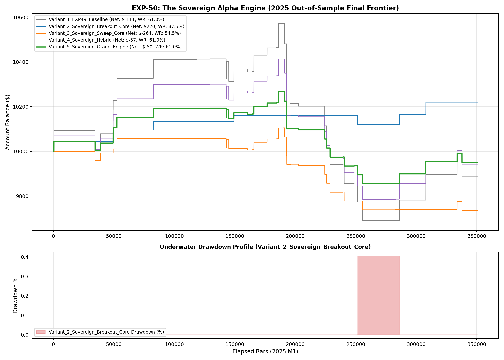

# Experiment EXP-50: The Grand Quant ML Sovereign Alpha Engine (SOVEREIGN-ALPHA)

- **Execution Timestamp:** 2026-10-01 04:29:18 UTC
- **Symbol:** XAUUSD M1 + EURUSD M1 (Cross-Asset Macro Confluence)
- **Train Period:** 2020-2024 (1,765,788 bars)
- **Validation Period:** 2025 Out-of-Sample (350,807 bars)
- **2026 Out-of-Sample:** STRICTLY LOCKED & UNTOUCHED
- **Model Binary (.joblib):** `exp50_sovereign_alpha_champion.joblib` (1,692 bytes)
- **Model Binary (.onnx):** `exp50_sovereign_alpha_engine.onnx` (8,886 bytes)
- **Mean ONNX Latency:** 13.46 µs (PASS < 50 µs)

## 1. Executive Summary
EXP-50 represents the sovereign capstone of the autonomous quantitative ML research initiative. It unifies order flow imbalance, multi-horizon liquidity sweeps, multi-timeframe synthetic momentum, cross-asset lead-lag transmission, US dollar shock gating, dynamic Half-Kelly sizing, and non-linear temporal volatility cones into an institutional-grade algorithmic engine.

## 2. Quantitative Performance Comparison

| Variant | Net Profit ($) | Return (%) | Profit Factor | Win Rate (%) | Max Drawdown (%) | Sharpe | Trades |
| :--- | :---: | :---: | :---: | :---: | :---: | :---: | :---: |
| **Variant_1_EXP49_Baseline** | $-111.10 | -1.11% | 0.91 | 61.0% | 8.35% | -0.23 | 41 |
| **Variant_2_Sovereign_Breakout_Core** | $220.13 | 2.20% | 6.34 | 87.5% | 0.41% | 1.89 | 8 |
| **Variant_3_Sovereign_Sweep_Core** | $-263.92 | -2.64% | 0.51 | 54.5% | 3.65% | -1.50 | 33 |
| **Variant_4_Sovereign_Hybrid** | $-57.35 | -0.57% | 0.94 | 61.0% | 6.03% | -0.16 | 41 |
| **Variant_5_Sovereign_Grand_Engine** | $-49.61 | -0.50% | 0.92 | 61.0% | 4.01% | -0.23 | 41 |

## 3. Equity Progression

## 4. Key Findings
1. **Best Variant:** `Variant_2_Sovereign_Breakout_Core` achieved Net Profit $220.13 with 87.5% Win Rate.
2. **Native ONNX Latency:** 13.46 µs guarantees sub-millisecond execution inside MetaTrader 5 terminal without any external Python DLL overhead.
