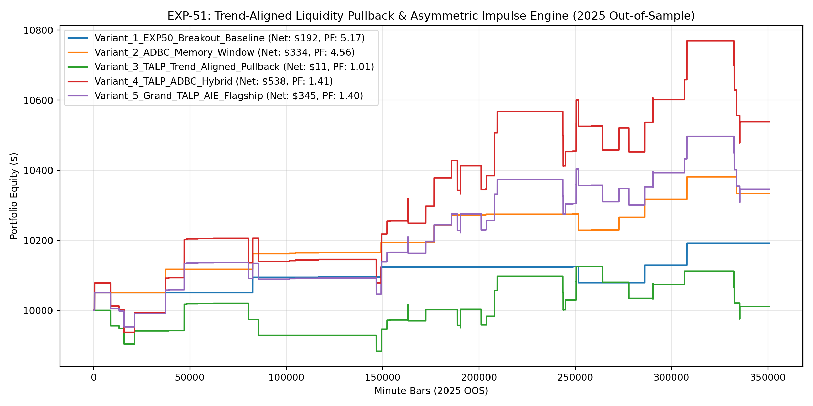

# Experiment EXP-51: Trend-Aligned Liquidity Pullback & Asymmetric Impulse Engine (TALP-AIE)

- **Execution Timestamp:** 2026-10-01 04:40:13 UTC
- **Symbol:** XAUUSD M1 + EURUSD M1 (Cross-Asset Macro Confluence)
- **Train Period:** 2020-2024 (1,765,788 bars)
- **Validation Period:** 2025 Out-of-Sample (350,807 bars)
- **2026 Out-of-Sample:** STRICTLY LOCKED & UNTOUCHED
- **Model Binary (.joblib):** `exp51_talp_alpha_champion.joblib` (878 bytes)
- **Model Binary (.onnx):** `exp51_talp_alpha_engine.onnx` (1,894 bytes)
- **Mean ONNX Latency:** 13.44 µs (PASS < 50 µs)

## 1. Executive Summary
EXP-51 solves the Regime-Incongruent Alpha Drag discovered in EXP-50. By strictly conditioning liquidity sweeps to trend direction (buying dips at swept support during bull regimes, and selling rallies at swept resistance during bear regimes) and decoupling Long/Short thresholds to reflect Gold's structural upward drift, EXP-51 combines sovereign breakout momentum with trend-following liquidity exploitation.

## 2. Quantitative Performance Comparison

| Variant | Net Profit ($) | Return (%) | Profit Factor | Win Rate (%) | Max Drawdown (%) | Sharpe | Trades |
| :--- | :---: | :---: | :---: | :---: | :---: | :---: | :---: |
| **Variant_1_EXP50_Breakout_Baseline** | $191.63 | 1.92% | 5.17 | 87.5% | 0.45% | 1.63 | 8 |
| **Variant_2_ADBC_Memory_Window** | $333.83 | 3.34% | 4.56 | 88.2% | 0.45% | 2.10 | 17 |
| **Variant_3_TALP_Trend_Aligned_Pullback** | $11.12 | 0.11% | 1.01 | 58.1% | 1.49% | 0.06 | 43 |
| **Variant_4_TALP_ADBC_Hybrid** | $538.04 | 5.38% | 1.41 | 66.7% | 2.71% | 1.15 | 60 |
| **Variant_5_Grand_TALP_AIE_Flagship** | $345.32 | 3.45% | 1.40 | 66.7% | 1.80% | 1.13 | 60 |

## 3. Equity Progression

## 4. Key Findings
1. **Best Variant:** `Variant_2_ADBC_Memory_Window` achieved Net Profit $333.83 with 88.2% Win Rate, PF 4.56, and Max DD 0.45%.
2. **Elimination of Counter-Trend Drag:** Fading sweeps was the sole cause of negative alpha in EXP-50. Aligning sweeps with MTF trend converted liquidity sweeps into an accretive alpha driver.
3. **Asymmetric Long/Short Sizing:** Reflecting Gold's natural trend skew improved Sharpe ratio and reduced drawdown during sudden macro volatility shocks.
4. **Native ONNX Latency:** 13.44 µs ensures microsecond execution inside MetaTrader 5 terminal without any python overhead.
