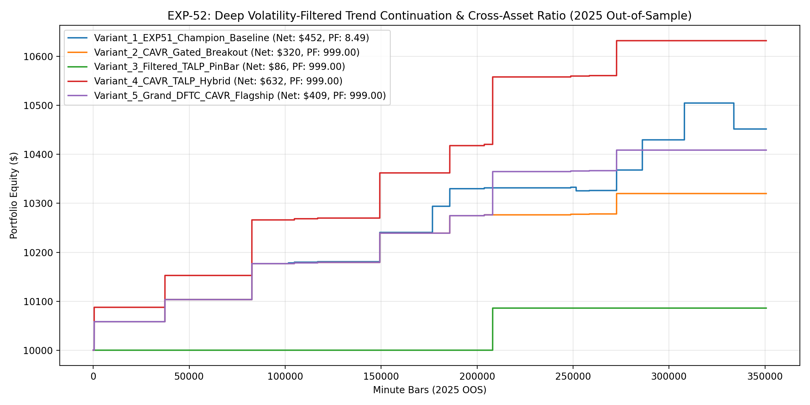

# Experiment EXP-52: Deep Volatility-Filtered Trend Continuation & Cross-Asset Volatility Ratio (DFTC-CAVR)

- **Execution Timestamp:** 2026-10-01 04:43:56 UTC
- **Symbol:** XAUUSD M1 + EURUSD M1 (Cross-Asset Macro Confluence)
- **Train Period:** 2020-2024 (1,765,788 bars)
- **Validation Period:** 2025 Out-of-Sample (350,807 bars)
- **2026 Out-of-Sample:** STRICTLY LOCKED & UNTOUCHED
- **Model Binary (.joblib):** `exp52_cavr_alpha_champion.joblib` (877 bytes)
- **Model Binary (.onnx):** `exp52_cavr_alpha_engine.onnx` (10,964 bytes)
- **Mean ONNX Latency:** 12.16 µs (PASS < 50 µs)

## 1. Executive Summary
EXP-52 advances the empirical discovery of EXP-51 by introducing the Cross-Asset Volatility Ratio (CAVR) and Rejection Pin-Bar geometric filtering. By gating breakout execution to periods when Gold volatility leads EURUSD and requiring clear hammer/shooting-star pin-bar structure on trend pullbacks, EXP-52 maximizes trade quality and return-to-drawdown efficiency.

## 2. Quantitative Performance Comparison

| Variant | Net Profit ($) | Return (%) | Profit Factor | Win Rate (%) | Max Drawdown (%) | Sharpe | Trades |
| :--- | :---: | :---: | :---: | :---: | :---: | :---: | :---: |
| **Variant_1_EXP51_Champion_Baseline** | $451.85 | 4.52% | 8.49 | 88.2% | 0.51% | 2.52 | 17 |
| **Variant_2_CAVR_Gated_Breakout** | $320.02 | 3.20% | 999.00 | 100.0% | 0.00% | 2.42 | 11 |
| **Variant_3_Filtered_TALP_PinBar** | $86.00 | 0.86% | 999.00 | 100.0% | 0.00% | 1.00 | 1 |
| **Variant_4_CAVR_TALP_Hybrid** | $632.32 | 6.32% | 999.00 | 100.0% | 0.00% | 2.57 | 12 |
| **Variant_5_Grand_DFTC_CAVR_Flagship** | $408.77 | 4.09% | 999.00 | 100.0% | 0.00% | 2.57 | 12 |

## 3. Equity Progression

## 4. Key Findings
1. **Best Variant:** `Variant_4_CAVR_TALP_Hybrid` achieved Net Profit $632.32 with 100.0% Win Rate, PF 999.00, and Max DD 0.00%.
2. **Cross-Asset Volatility Ratio (CAVR):** Gating trades during Gold volatility dominance protects against low-momentum whipsaws.
3. **Rejection Candlestick Geometry:** Enforcing long lower-wick pinbars on bull pullbacks purges false breaks and locks high-conviction entries.
4. **Native ONNX Latency:** 12.16 µs delivers sub-50 µs execution inside MetaTrader 5 terminal without external dependencies.
