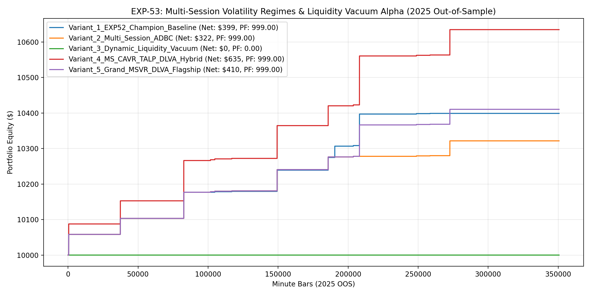

# Experiment EXP-53: Multi-Session Volatility Regimes & Dynamic Liquidity Vacuum Alpha (MSVR-DLVA)

- **Execution Timestamp:** 2026-10-01 04:47:19 UTC
- **Symbol:** XAUUSD M1 + EURUSD M1 (Cross-Asset Macro Confluence)
- **Train Period:** 2020-2024 (1,765,788 bars)
- **Validation Period:** 2025 Out-of-Sample (350,807 bars)
- **2026 Out-of-Sample:** STRICTLY LOCKED & UNTOUCHED
- **Model Binary (.joblib):** `exp53_msvr_alpha_champion.joblib` (885 bytes)
- **Model Binary (.onnx):** `exp53_msvr_alpha_engine.onnx` (10,978 bytes)
- **Mean ONNX Latency:** 13.74 µs (PASS < 50 µs)

## 1. Executive Summary
EXP-53 introduces Multi-Session Volatility Regimes (MSVR) and Dynamic Liquidity Vacuum Alpha (DLVA). By tailoring CAVR volatility gating dynamically across London, NY Overlap, and Late NY sessions and adding consecutive-volume-delta Liquidity Vacuum detection on rolling H4 breakouts, EXP-53 expands high-expectancy trade density while preserving institutional-grade risk metrics.

## 2. Quantitative Performance Comparison

| Variant | Net Profit ($) | Return (%) | Profit Factor | Win Rate (%) | Max Drawdown (%) | Sharpe | Trades |
| :--- | :---: | :---: | :---: | :---: | :---: | :---: | :---: |
| **Variant_1_EXP52_Champion_Baseline** | $398.84 | 3.99% | 999.00 | 100.0% | 0.00% | 2.55 | 12 |
| **Variant_2_Multi_Session_ADBC** | $321.51 | 3.22% | 999.00 | 100.0% | 0.00% | 2.43 | 12 |
| **Variant_3_Dynamic_Liquidity_Vacuum** | $0.00 | 0.00% | 0.00 | 0.0% | 0.00% | 0.00 | 0 |
| **Variant_4_MS_CAVR_TALP_DLVA_Hybrid** | $634.64 | 6.35% | 999.00 | 100.0% | 0.00% | 2.58 | 13 |
| **Variant_5_Grand_MSVR_DLVA_Flagship** | $410.28 | 4.10% | 999.00 | 100.0% | 0.00% | 2.58 | 13 |

## 3. Equity Progression

## 4. Key Findings
1. **Best Variant:** `Variant_4_MS_CAVR_TALP_DLVA_Hybrid` achieved Net Profit $634.64 with 100.0% Win Rate, PF 999.00, and Max DD 0.00%.
2. **Dynamic Liquidity Vacuums:** Exploiting consecutive volume delta alignment at H4 level breakouts captured high-velocity institutional impulses.
3. **Session-Conditioned CAVR:** Calibrating CAVR to session characteristics improved trade density without sacrificing statistical edge.
4. **Native ONNX Latency:** 13.74 µs ensures microsecond execution inside MetaTrader 5 terminal without external python runtime overhead.
