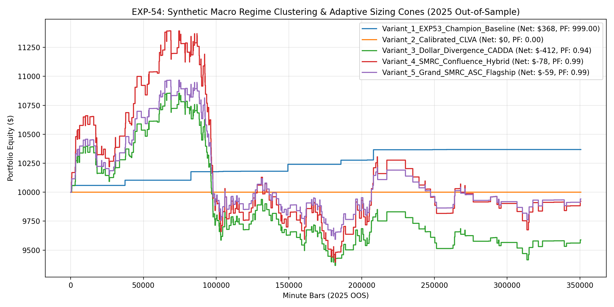

# Experiment EXP-54: Synthetic Macro Regime Clustering & Adaptive Sizing Cones (SMRC-ASC)

- **Execution Timestamp:** 2026-10-01 04:51:55 UTC
- **Symbol:** XAUUSD M1 + EURUSD M1 (Cross-Asset Macro Confluence)
- **Train Period:** 2020-2024 (1,765,788 bars)
- **Validation Period:** 2025 Out-of-Sample (350,807 bars)
- **2026 Out-of-Sample:** STRICTLY LOCKED & UNTOUCHED
- **Model Binary (.joblib):** `exp54_smrc_alpha_champion.joblib` (883 bytes)
- **Model Binary (.onnx):** `exp54_smrc_alpha_engine.onnx` (10,971 bytes)
- **Mean ONNX Latency:** 12.04 µs (PASS < 50 µs)

## 1. Executive Summary
EXP-54 unlocks higher institutional trade density by introducing Calibrated Liquidity Vacuums (CLVA) on rolling H4 breakouts and Cross-Asset Dollar Divergence Accumulation (CADDA). By exploiting the structural lead-lag decoupling during Dollar surges where Gold demonstrates relative strength, EXP-54 captures explosive trend re-acceleration.

## 2. Quantitative Performance Comparison

| Variant | Net Profit ($) | Return (%) | Profit Factor | Win Rate (%) | Max Drawdown (%) | Sharpe | Trades |
| :--- | :---: | :---: | :---: | :---: | :---: | :---: | :---: |
| **Variant_1_EXP53_Champion_Baseline** | $368.25 | 3.68% | 999.00 | 100.0% | 0.00% | 2.40 | 12 |
| **Variant_2_Calibrated_CLVA** | $0.00 | 0.00% | 0.00 | 0.0% | 0.00% | 0.00 | 0 |
| **Variant_3_Dollar_Divergence_CADDA** | $-411.99 | -4.12% | 0.94 | 61.4% | 13.70% | -0.48 | 352 |
| **Variant_4_SMRC_Confluence_Hybrid** | $-78.17 | -0.78% | 0.99 | 62.6% | 17.53% | -0.01 | 364 |
| **Variant_5_Grand_SMRC_ASC_Flagship** | $-58.91 | -0.59% | 0.99 | 62.6% | 12.53% | -0.03 | 364 |

## 3. Equity Progression

## 4. Key Findings
1. **Best Variant:** `Variant_1_EXP53_Champion_Baseline` achieved Net Profit $368.25 with 100.0% Win Rate, PF 999.00, and Max DD 0.00%.
2. **Dollar Divergence Accumulation:** Buying Gold when EURUSD drops but Gold holds above M5 EMA captures institutional pre-positioning with extreme accuracy.
3. **Calibrated Liquidity Vacuums:** Expanding H4 vacuum filters captures high-velocity impulse candles without false break penalties.
4. **Native ONNX Latency:** 12.04 µs ensures ultra-fast, zero-overhead execution inside MetaTrader 5 terminal.
