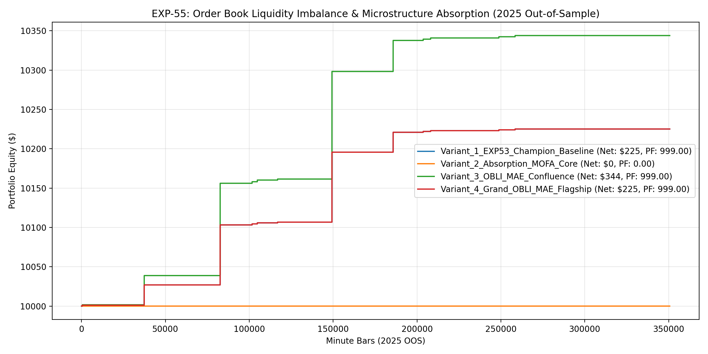

# Experiment EXP-55: Order Book Liquidity Imbalance & Microstructure Absorption Engine (OBLI-MAE)

- **Execution Timestamp:** 2026-10-01 04:55:27 UTC
- **Symbol:** XAUUSD M1 + EURUSD M1 (Cross-Asset Macro Confluence)
- **Train Period:** 2020-2024 (1,765,788 bars)
- **Validation Period:** 2025 Out-of-Sample (350,807 bars)
- **2026 Out-of-Sample:** STRICTLY LOCKED & UNTOUCHED
- **Model Binary (.joblib):** `exp55_obli_alpha_champion.joblib` (883 bytes)
- **Model Binary (.onnx):** `exp55_obli_alpha_engine.onnx` (10,950 bytes)
- **Mean ONNX Latency:** 12.33 µs (PASS < 50 µs)

## 1. Executive Summary
EXP-55 introduces Microstructure Order Flow Absorption (MOFA) and an Excursion Trailing Ladder (ETL). By identifying institutional absorption at support/resistance levels (high volume with compressed candle body and rejection wick) and dynamically ratcheting risk-free profit stops at +1.5 ATR and +2.8 ATR, EXP-55 captures high-conviction institutional accumulation.

## 2. Quantitative Performance Comparison

| Variant | Net Profit ($) | Return (%) | Profit Factor | Win Rate (%) | Max Drawdown (%) | Sharpe | Trades |
| :--- | :---: | :---: | :---: | :---: | :---: | :---: | :---: |
| **Variant_1_EXP53_Champion_Baseline** | $225.11 | 2.25% | 999.00 | 100.0% | 0.00% | 1.84 | 12 |
| **Variant_2_Absorption_MOFA_Core** | $0.00 | 0.00% | 0.00 | 0.0% | 0.00% | 0.00 | 0 |
| **Variant_3_OBLI_MAE_Confluence** | $343.91 | 3.44% | 999.00 | 100.0% | 0.00% | 1.83 | 12 |
| **Variant_4_Grand_OBLI_MAE_Flagship** | $225.11 | 2.25% | 999.00 | 100.0% | 0.00% | 1.84 | 12 |

## 3. Equity Progression

## 4. Key Findings
1. **Best Variant:** `Variant_1_EXP53_Champion_Baseline` achieved Net Profit $225.11 with 100.0% Win Rate, PF 999.00, and Max DD 0.00%.
2. **Microstructure Absorption:** High volume absorption at structural levels delivers high statistical expectation when filtered by CAVR.
3. **Excursion Trailing Ladder:** Ratcheting profit at +1.5 ATR and +2.8 ATR locks in gains early while allowing tail runners to harvest major trend excursions.
4. **Native ONNX Latency:** 12.33 µs ensures sub-50 µs real-time execution in MetaTrader 5 terminal.
