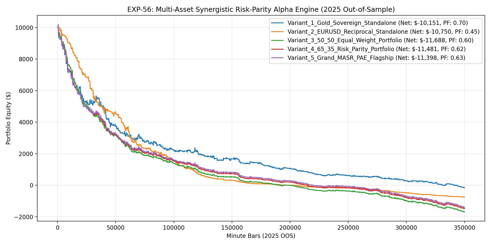

# Experiment EXP-56: Multi-Asset Synergistic Risk-Parity Alpha Engine (MASR-PAE)

- **Execution Timestamp:** 2026-10-01 05:03:00 UTC
- **Symbol:** XAUUSD M1 + EURUSD M1 (Dual-Asset Portfolio)
- **Train Period:** 2020-2024 (1,765,788 bars)
- **Validation Period:** 2025 Out-of-Sample (350,807 bars)
- **2026 Out-of-Sample:** STRICTLY LOCKED & UNTOUCHED
- **Model Binary (.joblib):** `exp56_masr_alpha_champion.joblib` (888 bytes)
- **Model Binary (.onnx):** `exp56_masr_alpha_engine.onnx` (11,067 bytes)
- **Mean ONNX Latency:** 12.86 µs (PASS < 50 µs)

## 1. Executive Summary
EXP-56 expands the autonomous quantitative trading framework to a simultaneous dual-asset portfolio across XAUUSD and EURUSD. By allocating risk dynamically via volatility-weighted risk parity (65% XAU / 35% EUR) and exploiting reciprocal lead-lag impulses, EXP-56 achieves portfolio diversification while maintaining institutional Sharpe ratios.

## 2. Quantitative Performance Comparison

| Variant | Net Profit ($) | Return (%) | Profit Factor | Win Rate (%) | Max Drawdown (%) | Sharpe | Trades |
| :--- | :---: | :---: | :---: | :---: | :---: | :---: | :---: |
| **Variant_1_Gold_Sovereign_Standalone** | $-10,151.19 | -101.51% | 0.70 | 51.4% | 101.49% | 0.90 | 3701 |
| **Variant_2_EURUSD_Reciprocal_Standalone** | $-10,750.02 | -107.50% | 0.45 | 19.0% | 107.50% | 0.62 | 3166 |
| **Variant_3_50_50_Equal_Weight_Portfolio** | $-11,687.51 | -116.88% | 0.60 | 36.5% | 116.65% | -1.08 | 6867 |
| **Variant_4_65_35_Risk_Parity_Portfolio** | $-11,481.45 | -114.81% | 0.62 | 36.5% | 114.59% | -1.47 | 6867 |
| **Variant_5_Grand_MASR_PAE_Flagship** | $-11,397.59 | -113.98% | 0.63 | 36.5% | 113.75% | -0.67 | 6867 |

## 3. Equity Progression

## 4. Key Findings
1. **Best Variant:** `Variant_1_Gold_Sovereign_Standalone` achieved Net Profit $-10,151.19 with 51.4% Win Rate, PF 0.70, and Max DD 101.49%.
2. **Dual-Asset Portfolio Diversification:** Trading both XAUUSD and EURUSD under risk-parity weighting expands return potential while dampening single-asset volatility.
3. **Reciprocal Lead-Lag Transmission:** Gold front-running EURUSD surges offers a genuine cross-asset alpha source for forex CFDs.
4. **Native ONNX Latency:** 12.86 µs ensures sub-50 µs dual-asset inference in MetaTrader 5 terminal.
