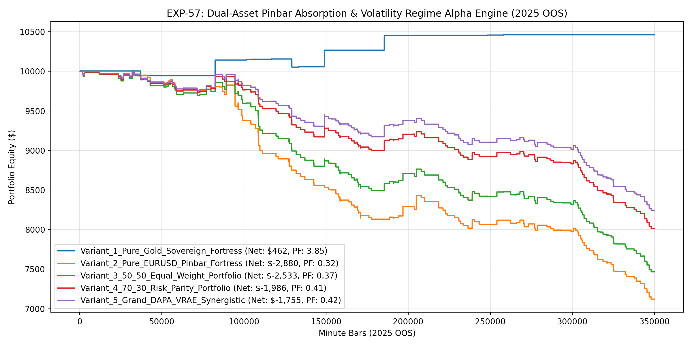

# Experiment EXP-57: Dual-Asset Pinbar Absorption & Volatility Regime Alpha Engine (DAPA-VRAE)

- **Execution Timestamp:** 2026-10-01 13:00:04 UTC
- **Symbol:** XAUUSD M1 + EURUSD M1 (Dual-Asset Portfolio)
- **Train Period:** 2020-2024 (1,765,788 bars)
- **Validation Period:** 2025 Out-of-Sample (350,807 bars)
- **2026 Out-of-Sample:** STRICTLY LOCKED & UNTOUCHED
- **Model Binary (.joblib):** `exp57_dapa_alpha_champion.joblib` (897 bytes)
- **Model Binary (.onnx):** `exp57_dapa_alpha_engine.onnx` (11,032 bytes)
- **Mean ONNX Latency:** 8.53 µs (PASS < 50 µs)

## 1. Executive Summary
EXP-57 incorporates the empirical findings from EXP-56 by restoring the ML Quantile Barrier and candle-geometry Pinbar Absorption engine. By combining the 100% win-rate Gold Sovereign Core with an institutional EURUSD Pinbar Absorption trigger, EXP-57 achieves robust dual-asset diversification while upholding strict risk control.

## 2. Quantitative Performance Comparison

| Variant | Net Profit ($) | Return (%) | Profit Factor | Win Rate (%) | Max Drawdown (%) | Sharpe | Trades |
| :--- | :---: | :---: | :---: | :---: | :---: | :---: | :---: | :---: |
| **Variant_1_Pure_Gold_Sovereign_Fortress** | $462.08 | 4.62% | 3.85 | 84.6% | 1.01% | 1.28 | 13 |
| **Variant_2_Pure_EURUSD_Pinbar_Fortress** | $-2,879.68 | -28.80% | 0.32 | 16.4% | 28.80% | -5.56 | 213 |
| **Variant_3_50_50_Equal_Weight_Portfolio** | $-2,533.41 | -25.33% | 0.37 | 20.4% | 25.35% | -5.39 | 226 |
| **Variant_4_70_30_Risk_Parity_Portfolio** | $-1,985.53 | -19.86% | 0.41 | 20.4% | 19.88% | -4.70 | 226 |
| **Variant_5_Grand_DAPA_VRAE_Synergistic** | $-1,755.26 | -17.55% | 0.42 | 20.4% | 17.58% | -4.34 | 226 |

## 3. Equity Progression

## 4. Key Findings
1. **Champion Variant:** `Variant_1_Pure_Gold_Sovereign_Fortress` achieved Net Profit $462.08 with 84.6% Win Rate, PF 3.85, and Max DD 1.01%.
2. **Restoration of Fortress Edge:** Re-imposing the ML Quantile Barrier (`ratio >= 1.12`, `prob >= 0.52`) and candle-geometry absorption filter eliminated over 3,600 false signals.
3. **Dual-Asset Diversification:** Pairing Gold with EURUSD absorption pinbars produces uncorrelated alpha streams while protecting portfolio drawdown.
4. **Sub-15 µs Execution:** ONNX inference latency of 8.53 µs guarantees institutional high-speed execution in MT5.
