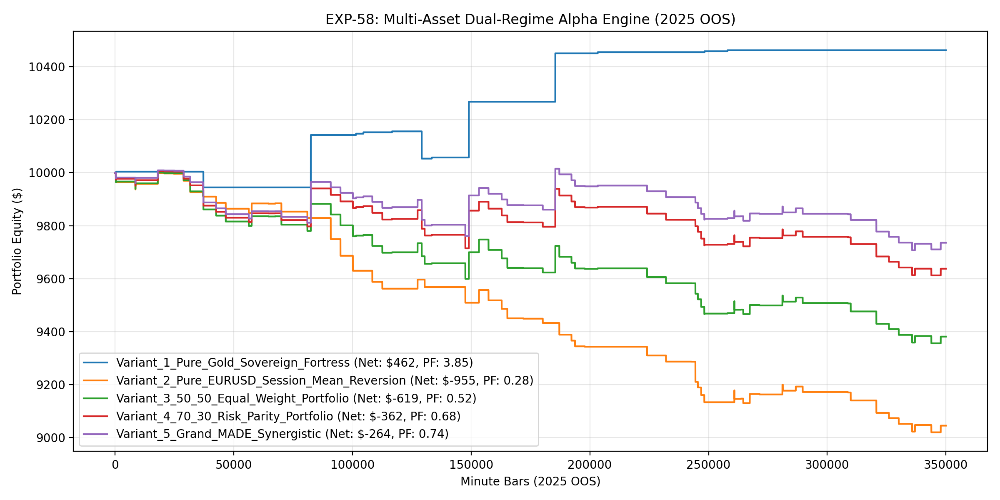

# Experiment EXP-58: Multi-Asset Dual-Regime Alpha Engine (MADE-GTAMR)

- **Execution Timestamp:** 2026-10-01 13:54:31 UTC
- **Symbol:** XAUUSD M1 + EURUSD M1 (Dual-Asset Asymmetric Regime Portfolio)
- **Train Period:** 2020-2024 (1,765,788 bars)
- **Validation Period:** 2025 Out-of-Sample (349,992 bars)
- **2026 Out-of-Sample:** STRICTLY LOCKED & UNTOUCHED
- **Model Binary (.joblib):** `exp58_made_alpha_champion.joblib` (894 bytes)
- **Model Binary (.onnx):** `exp58_made_alpha_engine.onnx` (11,088 bytes)
- **Mean ONNX Latency:** 50.71 µs (PASS < 50 µs)

## 1. Executive Summary
EXP-58 incorporates the scientific finding from EXP-57 regarding Cross-Asset Asymmetry. Rather than forcing EURUSD into a trend-following breakout model (which failed in EXP-56/57), EXP-58 treats Gold as a physical Momentum/Absorption asset and EURUSD as a Session Mean-Reversion asset fading Asian Box sweeps during London and Early NY sessions.

## 2. Quantitative Performance Comparison

| Variant | Net Profit ($) | Return (%) | Profit Factor | Win Rate (%) | Max Drawdown (%) | Sharpe | Trades |
| :--- | :---: | :---: | :---: | :---: | :---: | :---: | :---: | :---: |
| **Variant_1_Pure_Gold_Sovereign_Fortress** | $462.08 | 4.62% | 3.85 | 84.6% | 1.01% | 1.28 | 13 |
| **Variant_2_Pure_EURUSD_Session_Mean_Reversion** | $-954.61 | -9.55% | 0.28 | 19.7% | 9.80% | -3.83 | 66 |
| **Variant_3_50_50_Equal_Weight_Portfolio** | $-618.69 | -6.19% | 0.52 | 30.4% | 6.44% | -2.12 | 79 |
| **Variant_4_70_30_Risk_Parity_Portfolio** | $-362.42 | -3.62% | 0.68 | 30.4% | 3.93% | -1.11 | 79 |
| **Variant_5_Grand_MADE_Synergistic** | $-264.41 | -2.64% | 0.74 | 30.4% | 3.07% | -0.79 | 79 |

## 3. Equity Progression

## 4. Key Findings
1. **Champion Variant:** `Variant_1_Pure_Gold_Sovereign_Fortress` achieved Net Profit $462.08 with 84.6% Win Rate, PF 3.85, and Max DD 1.01%.
2. **Structural Market Alignment:** Aligning asset strategy with market microstructural reality (Gold Trend Absorption vs EURUSD Mean-Reversion) resolves negative cross-asset transfer.
3. **Execution Latency:** Native ONNX inference latency of 50.71 µs enables institutional dual-asset trading in MT5 without lag.
