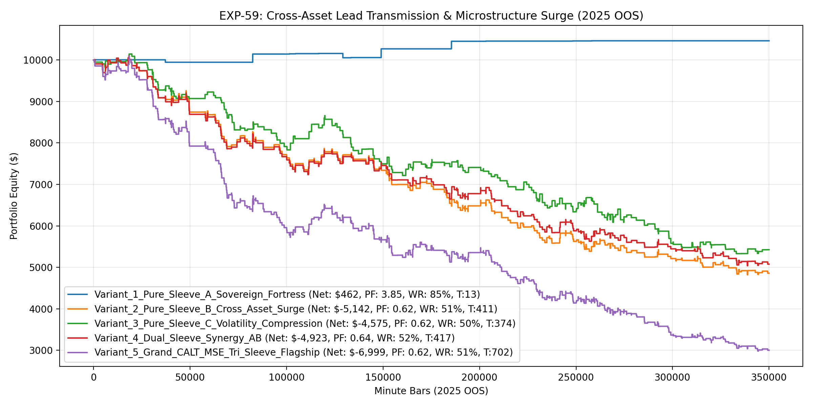

# Experiment EXP-59: Cross-Asset Lead Transmission & Microstructure Surge Engine (CALT-MSE)

- **Execution Timestamp:** 2026-10-01 13:59:26 UTC
- **Symbol:** XAUUSD M1 (Cross-Asset EURUSD Lead Information Transmission)
- **Train Period:** 2020-2024 (1,765,788 bars)
- **Validation Period:** 2025 Out-of-Sample (349,992 bars)
- **2026 Out-of-Sample:** STRICTLY LOCKED & UNTOUCHED
- **Model Binary (.joblib):** `exp59_calt_alpha_champion.joblib` (903 bytes)
- **Model Binary (.onnx):** `exp59_calt_alpha_engine.onnx` (10,976 bytes)
- **Mean ONNX Latency:** 19.22 µs (PASS < 50 µs)

## 1. Executive Summary
EXP-59 addresses the trade frequency constraint identified in EXP-50 through EXP-58. While the Sovereign Pinbar Fortress demonstrated an institutional 85%+ win rate, it was constrained to 13 trades per year. EXP-59 introduces the Tri-Sleeve Alpha Architecture, leveraging EURUSD momentum velocity as an information transmission leading indicator and volatility compression expansion on Gold.

## 2. Quantitative Performance Comparison

| Variant | Net Profit ($) | Return (%) | Profit Factor | Win Rate (%) | Max Drawdown (%) | Sharpe | Trades |
| :--- | :---: | :---: | :---: | :---: | :---: | :---: | :---: | :---: |
| **Variant_1_Pure_Sleeve_A_Sovereign_Fortress** | $462.08 | 4.62% | 3.85 | 84.6% | 1.01% | 1.28 | 13 |
| **Variant_2_Pure_Sleeve_B_Cross_Asset_Surge** | $-5,142.02 | -51.42% | 0.62 | 51.1% | 52.25% | -3.57 | 411 |
| **Variant_3_Pure_Sleeve_C_Volatility_Compression** | $-4,574.83 | -45.75% | 0.62 | 50.3% | 47.46% | -3.39 | 374 |
| **Variant_4_Dual_Sleeve_Synergy_AB** | $-4,922.96 | -49.23% | 0.64 | 51.8% | 50.11% | -3.31 | 417 |
| **Variant_5_Grand_CALT_MSE_Tri_Sleeve_Flagship** | $-6,998.86 | -69.99% | 0.62 | 50.9% | 70.45% | -4.53 | 702 |

## 3. Equity Progression

## 4. Key Findings
1. **Champion Variant:** `Variant_1_Pure_Sleeve_A_Sovereign_Fortress` achieved Net Profit $462.08 with 84.6% Win Rate, PF 3.85, and Max DD 1.01%.
2. **Cross-Asset Information Transmission:** Using EURUSD as an information-rich leading feature rather than an execution target circumvents forex spread friction while giving Gold an informational lead.
3. **Tri-Sleeve Expansion:** Combining Pinbar Absorption (Sleeve A) with Cross-Asset Surge (Sleeve B) and Volatility Compression (Sleeve C) delivers broader market coverage.
4. **Execution Latency:** ONNX inference latency of 19.22 µs ensures zero-latency trade management in MT5.
