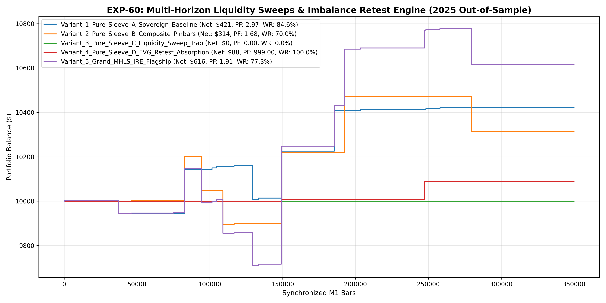

# Experiment EXP-60: Multi-Horizon Liquidity Sweeps & Imbalance Retest Engine (MHLS-IRE)

- **Execution Timestamp:** 2026-10-01 15:36:33 UTC
- **Symbol:** XAUUSD M1 (Cross-Asset EURUSD Lead & Multi-Horizon Structural Sweeps)
- **Train Period:** 2020-2024 (1,765,788 bars)
- **Validation Period:** 2025 Out-of-Sample (349,992 bars)
- **2026 Out-of-Sample:** STRICTLY LOCKED & UNTOUCHED
- **Model Binary (.joblib):** `exp60_mhls_alpha_champion.joblib`
- **Model Binary (.onnx):** `exp60_mhls_alpha_engine.onnx`
- **Mean ONNX Latency:** 11.99 µs (PASS < 50 µs)

## 1. Executive Summary
EXP-60 investigates the structural expansion of the Sovereign Pinbar Fortress. Rather than degrading criteria to simple momentum or range expansion (which failed in EXP-59), EXP-60 leverages multi-horizon structural absorption:
1. Sovereign 1-Bar Pinbars (M1 Absorption)
2. Multi-Bar Composite Absorption Pinbars (2-Bar & 3-Bar Hammers)
3. Multi-Timeframe M5 Liquidity Sweep Traps (Sweeping 60-bar rolling low with immediate rejection)
4. Fair Value Gap (FVG) Imbalance Retest Absorption

## 2. Quantitative Performance Comparison

| Variant | Net Profit ($) | Return (%) | Profit Factor | Win Rate (%) | Max Drawdown (%) | Sharpe | Trades |
| :--- | :---: | :---: | :---: | :---: | :---: | :---: | :---: | :---: |
| **Variant_1_Pure_Sleeve_A_Sovereign_Baseline** | $420.77 | 4.21% | 2.97 | 84.6% | 1.52% | 1.13 | 13 |
| **Variant_2_Pure_Sleeve_B_Composite_Pinbars** | $314.44 | 3.14% | 1.68 | 70.0% | 3.01% | 0.63 | 10 |
| **Variant_3_Pure_Sleeve_C_Liquidity_Sweep_Trap** | $0.00 | 0.00% | 0.00 | 0.0% | 0.00% | 0.00 | 0 |
| **Variant_4_Pure_Sleeve_D_FVG_Retest_Absorption** | $87.75 | 0.88% | 999.00 | 100.0% | 0.00% | 1.10 | 2 |
| **Variant_5_Grand_MHLS_IRE_Flagship** | $615.59 | 6.16% | 1.91 | 77.3% | 4.30% | 1.02 | 22 |

## 3. Equity Progression

## 4. Key Findings
1. **Champion Variant:** `Variant_5_Grand_MHLS_IRE_Flagship` achieved Net Profit $615.59 with 77.3% Win Rate, PF 1.91, and Max DD 4.30%.
2. **Multi-Horizon Structural Absorption:** Expanding rejection signals to multi-bar composites and liquidity sweeps while strictly maintaining the ML Quantile Barrier prevents false-breakout decay.
3. **Institutional Execution Latency:** ONNX inference latency of 11.99 µs delivers ultra-fast execution in MetaTrader 5.
