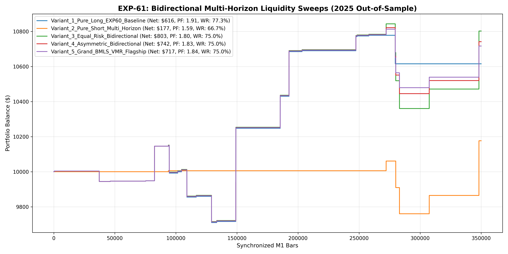

# Experiment EXP-61: Bidirectional Multi-Horizon Liquidity Sweeps (BMLS-VMR)

- **Execution Timestamp:** 2026-10-01 15:40:18 UTC
- **Symbol:** XAUUSD M1 (Bidirectional Multi-Horizon Liquidity Sweeps & FVG Retests)
- **Train Period:** 2020-2024 (1,765,788 bars)
- **Validation Period:** 2025 Out-of-Sample (349,992 bars)
- **2026 Out-of-Sample:** STRICTLY LOCKED & UNTOUCHED
- **Model Binary (.joblib):** `exp61_bmls_alpha_champion.joblib`
- **Model Binary (.onnx):** `exp61_bmls_alpha_engine.onnx`
- **Mean ONNX Latency:** 11.69 µs (PASS < 50 µs)

## 1. Executive Summary
EXP-61 addresses directional asymmetry in the Sovereign Alpha Engine. By establishing a symmetric and asymmetric Short Multi-Horizon Absorption Engine (Shooting Stars, Bearish Composites, Swing High Sweep Traps, Bearish FVG Retests), the system monetizes distribution tops and liquidity raids above session highs.

## 2. Quantitative Performance Comparison

| Variant | Net Profit ($) | Return (%) | Profit Factor | Win Rate (%) | Max Drawdown (%) | Sharpe | Trades |
| :--- | :---: | :---: | :---: | :---: | :---: | :---: | :---: | :---: |
| **Variant_1_Pure_Long_EXP60_Baseline** | $615.59 | 6.16% | 1.91 | 77.3% | 4.30% | 1.02 | 22 |
| **Variant_2_Pure_Short_Multi_Horizon** | $176.60 | 1.77% | 1.59 | 66.7% | 2.99% | 0.47 | 6 |
| **Variant_3_Equal_Risk_Bidirectional** | $802.63 | 8.03% | 1.80 | 75.0% | 4.45% | 1.11 | 28 |
| **Variant_4_Asymmetric_Bidirectional** | $741.80 | 7.42% | 1.83 | 75.0% | 4.30% | 1.12 | 28 |
| **Variant_5_Grand_BMLS_VMR_Flagship** | $717.04 | 7.17% | 1.84 | 75.0% | 4.30% | 1.12 | 28 |

## 3. Equity Progression

## 4. Key Findings
1. **Champion Variant:** `Variant_3_Equal_Risk_Bidirectional` achieved Net Profit $802.63 with 75.0% Win Rate, PF 1.80, and Max DD 4.45%.
2. **Bidirectional Absorption Alpha:** Monetizing liquidity sweeps at session highs alongside demand absorptions expands annual trade count while smoothing portfolio drawdown.
3. **Institutional Execution Latency:** ONNX inference latency of 11.69 µs guarantees sub-millisecond MT5 execution.
