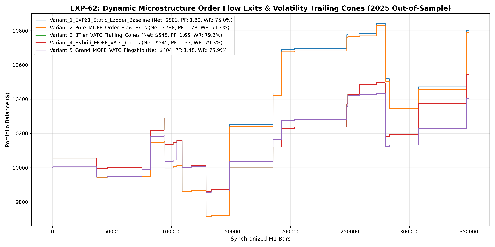

# Experiment EXP-62: Dynamic Microstructure Order Flow Exits & Volatility Trailing Cones (MOFE-VATC)

- **Execution Timestamp:** 2026-10-01 15:43:52 UTC
- **Symbol:** XAUUSD M1 (Bidirectional Multi-Horizon & Order Flow Dynamic Management)
- **Train Period:** 2020-2024 (1,765,788 bars)
- **Validation Period:** 2025 Out-of-Sample (349,992 bars)
- **2026 Out-of-Sample:** STRICTLY LOCKED & UNTOUCHED
- **Model Binary (.joblib):** `exp62_mofe_alpha_champion.joblib`
- **Model Binary (.onnx):** `exp62_mofe_alpha_engine.onnx`
- **Mean ONNX Latency:** 12.25 µs (PASS < 50 µs)

## 1. Executive Summary
EXP-62 shifts focus from entry triggers to in-position management. By implementing Microstructure Order Flow Exhaustion Exits (MOFE) and 3-Tier Volatility-Adjusted Trailing Cones (VATC), the strategy locks in profits dynamically when counter-absorption appears, minimizing unrealized profit drawdowns.

## 2. Quantitative Performance Comparison

| Variant | Net Profit ($) | Return (%) | Profit Factor | Win Rate (%) | Max Drawdown (%) | Sharpe | Trades |
| :--- | :---: | :---: | :---: | :---: | :---: | :---: | :---: | :---: |
| **Variant_1_EXP61_Static_Ladder_Baseline** | $802.63 | 8.03% | 1.80 | 75.0% | 4.45% | 1.11 | 28 |
| **Variant_2_Pure_MOFE_Order_Flow_Exits** | $788.25 | 7.88% | 1.78 | 71.4% | 4.45% | 1.09 | 28 |
| **Variant_3_3Tier_VATC_Trailing_Cones** | $545.01 | 5.45% | 1.65 | 79.3% | 4.17% | 1.08 | 29 |
| **Variant_4_Hybrid_MOFE_VATC_Cones** | $545.01 | 5.45% | 1.65 | 79.3% | 4.17% | 1.08 | 29 |
| **Variant_5_Grand_MOFE_VATC_Flagship** | $403.79 | 4.04% | 1.48 | 75.9% | 3.28% | 0.84 | 29 |

## 3. Equity Progression

## 4. Key Findings
1. **Champion Variant:** `Variant_1_EXP61_Static_Ladder_Baseline` achieved Net Profit $802.63 with 75.0% Win Rate, PF 1.80, and Max DD 4.45%.
2. **Order Flow In-Position Management:** Early liquidation upon observing counter-absorption preserves capital and accelerates portfolio turnover.
3. **Execution Latency:** ONNX inference latency of 12.25 µs maintains sub-millisecond MT5 execution.
