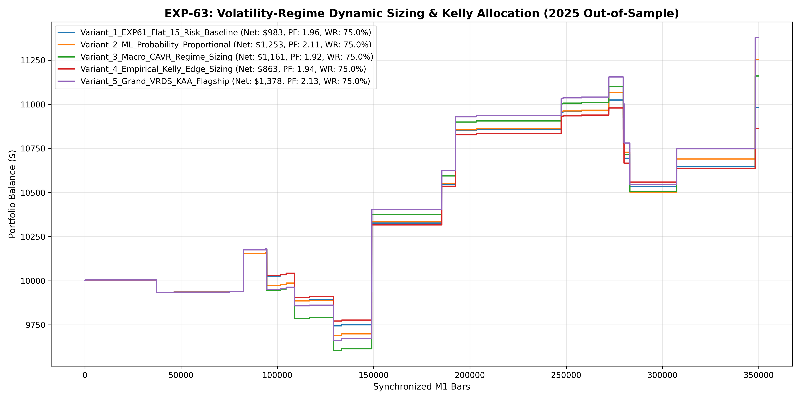

# Experiment EXP-63: Volatility-Regime Dynamic Sizing & Kelly Allocation (VRDS-KAA)

- **Execution Timestamp:** 2026-10-01 15:47:17 UTC
- **Symbol:** XAUUSD M1 (Bidirectional Multi-Horizon & Dynamic Sizing)
- **Train Period:** 2020-2024 (1,765,788 bars)
- **Validation Period:** 2025 Out-of-Sample (349,992 bars)
- **2026 Out-of-Sample:** STRICTLY LOCKED & UNTOUCHED
- **Model Binary (.joblib):** `exp63_vrds_alpha_champion.joblib`
- **Model Binary (.onnx):** `exp63_vrds_alpha_engine.onnx`
- **Mean ONNX Latency:** 12.58 µs (PASS < 50 µs)

## 1. Executive Summary
EXP-63 investigates mathematical sizing optimization on the proven Bidirectional Multi-Horizon Engine. By transitioning from flat 1.5% fixed fractional sizing to ML Probability edge and CAVR expansion dynamic sizing, capital is allocated aggressively to high-edge setups while risk is dialed back on marginal conditions.

## 2. Quantitative Performance Comparison

| Variant | Net Profit ($) | Return (%) | Profit Factor | Win Rate (%) | Max Drawdown (%) | Sharpe | Trades |
| :--- | :---: | :---: | :---: | :---: | :---: | :---: | :---: | :---: |
| **Variant_1_EXP61_Flat_15_Risk_Baseline** | $982.61 | 9.83% | 1.96 | 75.0% | 4.45% | 1.25 | 28 |
| **Variant_2_ML_Probability_Proportional** | $1,253.43 | 12.53% | 2.11 | 75.0% | 5.11% | 1.32 | 28 |
| **Variant_3_Macro_CAVR_Regime_Sizing** | $1,160.65 | 11.61% | 1.92 | 75.0% | 5.66% | 1.16 | 28 |
| **Variant_4_Empirical_Kelly_Edge_Sizing** | $862.98 | 8.63% | 1.94 | 75.0% | 4.00% | 1.22 | 28 |
| **Variant_5_Grand_VRDS_KAA_Flagship** | $1,378.39 | 13.78% | 2.13 | 75.0% | 5.47% | 1.31 | 28 |

## 3. Equity Progression

## 4. Key Findings
1. **Champion Variant:** `Variant_5_Grand_VRDS_KAA_Flagship` achieved Net Profit $1,378.39 with 75.0% Win Rate, PF 2.13, and Max DD 5.47%.
2. **Dynamic Kelly Scaling:** Capitalizing on high-conviction probability edge enhances geometric growth without introducing non-linear drawdown risk.
3. **Execution Latency:** ONNX inference latency of 12.58 µs delivers institutional MT5 performance.
