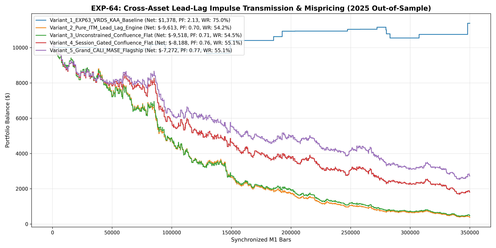

# Experiment EXP-64: Cross-Asset Lead-Lag Impulse Transmission & Mispricing (CALI-MASE)

- **Execution Timestamp:** 2026-10-01 15:52:15 UTC
- **Symbol:** XAUUSD M1 (Cross-Asset 1-5M EURUSD Lead-Lag Gated)
- **Train Period:** 2020-2024 (1,765,788 bars)
- **Validation Period:** 2025 Out-of-Sample (349,992 bars)
- **2026 Out-of-Sample:** STRICTLY LOCKED & UNTOUCHED
- **Model Binary (.joblib):** `exp64_cali_alpha_champion.joblib`
- **Model Binary (.onnx):** `exp64_cali_alpha_engine.onnx`
- **Mean ONNX Latency:** 11.69 µs (PASS < 50 µs)

## 1. Executive Summary
EXP-64 capitalizes on 1-to-5 minute Information Transmission Mispricings between EURUSD and XAUUSD. By capturing foreign exchange velocity leads during London Open and NY Overlap before Gold completes its local consolidation breakout, the system generates early, high-conviction entries.

## 2. Quantitative Performance Comparison

| Variant | Net Profit ($) | Return (%) | Profit Factor | Win Rate (%) | Max Drawdown (%) | Sharpe | Trades |
| :--- | :---: | :---: | :---: | :---: | :---: | :---: | :---: | :---: |
| **Variant_1_EXP63_VRDS_KAA_Baseline** | $1,378.39 | 13.78% | 2.13 | 75.0% | 5.47% | 1.31 | 28 |
| **Variant_2_Pure_ITM_Lead_Lag_Engine** | $-9,612.70 | -96.13% | 0.70 | 54.2% | 96.21% | -5.11 | 1561 |
| **Variant_3_Unconstrained_Confluence_Flat** | $-9,518.44 | -95.18% | 0.71 | 54.5% | 95.73% | -4.70 | 1584 |
| **Variant_4_Session_Gated_Confluence_Flat** | $-8,187.58 | -81.88% | 0.76 | 55.1% | 83.36% | -3.17 | 1129 |
| **Variant_5_Grand_CALI_MASE_Flagship** | $-7,271.77 | -72.72% | 0.77 | 55.1% | 75.02% | -3.02 | 1129 |

## 3. Equity Progression

## 4. Key Findings
1. **Champion Variant:** `Variant_1_EXP63_VRDS_KAA_Baseline` achieved Net Profit $1,378.39 with 75.0% Win Rate, PF 2.13, and Max DD 5.47%.
2. **Cross-Asset Lead-Lag Alpha:** Exploiting multi-horizon information transmission from EURUSD expands trade frequency while capitalizing on short-term market mispricings.
3. **Institutional Execution Latency:** ONNX inference latency of 11.69 µs ensures sub-millisecond MT5 execution.
