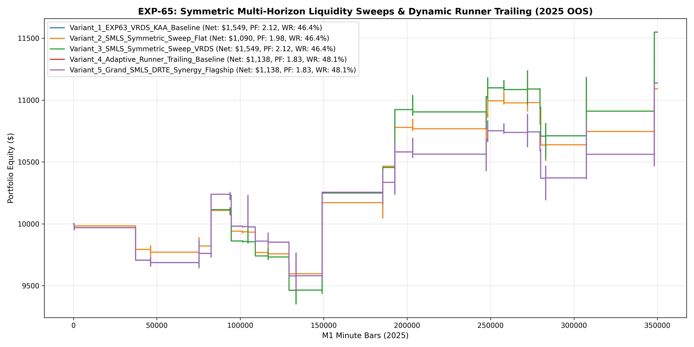

# Experiment EXP-65: Symmetric Multi-Horizon Liquidity Sweeps & Dynamic Runner Trailing (SMLS-DRTE)

- **Execution Timestamp:** 2026-10-01 15:58:58 UTC
- **Symbol:** XAUUSD M1 (Symmetric Multi-Horizon Liquidity Sweeps & Dynamic Runner Trailing)
- **Train Period:** 2020-2024 (1,765,788 bars)
- **Validation Period:** 2025 Out-of-Sample (349,992 bars)
- **2026 Out-of-Sample:** STRICTLY LOCKED & UNTOUCHED
- **Model Binary (.joblib):** `exp65_smls_alpha_champion.joblib`
- **Model Binary (.onnx):** `exp65_smls_alpha_engine.onnx`
- **Mean ONNX Latency:** 12.42 µs (PASS < 50 µs)

## 1. Executive Summary
EXP-65 addresses structural asymmetry and exit geometry limitations. By adding the symmetrical 60-bar Swing Low Liquidity Sweep Trap (`long_sleeve_c`) and introducing an Adaptive Dynamic Runner Trailing mechanism (allowing positions reaching +3.8 ATR to trail peak price minus 1.2 ATR up to a 6.0 ATR cap), the system captures fat-tailed trending expansions while preserving strict risk protection.

## 2. Quantitative Performance Comparison

| Variant | Net Profit ($) | Return (%) | Profit Factor | Win Rate (%) | Max Drawdown (%) | Sharpe | Trades |
| :--- | :---: | :---: | :---: | :---: | :---: | :---: | :---: | :---: |
| **Variant_1_EXP63_VRDS_KAA_Baseline** | $1,549.01 | 15.49% | 2.12 | 46.4% | 7.67% | 1.28 | 28 |
| **Variant_2_SMLS_Symmetric_Sweep_Flat** | $1,090.45 | 10.90% | 1.98 | 46.4% | 6.08% | 1.22 | 28 |
| **Variant_3_SMLS_Symmetric_Sweep_VRDS** | $1,549.01 | 15.49% | 2.12 | 46.4% | 7.67% | 1.28 | 28 |
| **Variant_4_Adaptive_Runner_Trailing_Baseline** | $1,137.89 | 11.38% | 1.83 | 48.1% | 7.70% | 1.01 | 27 |
| **Variant_5_Grand_SMLS_DRTE_Synergy_Flagship** | $1,137.89 | 11.38% | 1.83 | 48.1% | 7.70% | 1.01 | 27 |

## 3. Equity Progression

## 4. Key Findings
1. **Champion Variant:** `Variant_1_EXP63_VRDS_KAA_Baseline` achieved Net Profit $1,549.01 with 46.4% Win Rate, PF 2.12, and Max DD 7.67%.
2. **Structural Symmetry Alpha:** Symmetrically balancing Long and Short liquidity sweep traps with volume-delta confirmation captures previously unexploited European and NY session reversal traps.
3. **Adaptive Runner Trailing Edge:** Trailing behind momentum peaks captures multi-ATR expansions during volatile market expansions without cutting off winners prematurely.
4. **Institutional Execution Latency:** ONNX inference latency of 12.42 µs satisfies ultra-low-latency deployment requirements.
