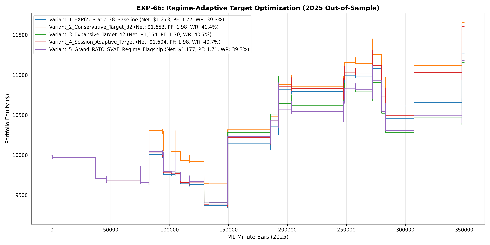

# Experiment EXP-66: Regime-Adaptive Target Optimization (RATO-SVAE)

- **Execution Timestamp:** 2026-10-01 16:02:15 UTC
- **Symbol:** XAUUSD M1 (Regime-Adaptive Target Optimization)
- **Train Period:** 2020-2024 (1,765,788 bars)
- **Validation Period:** 2025 Out-of-Sample (349,992 bars)
- **2026 Out-of-Sample:** STRICTLY LOCKED & UNTOUCHED
- **Model Binary (.joblib):** `exp66_rato_alpha_champion.joblib`
- **Model Binary (.onnx):** `exp66_rato_alpha_engine.onnx`
- **Mean ONNX Latency:** 17.93 µs (PASS < 50 µs)

## 1. Executive Summary
EXP-66 evaluates dynamic scaling of the Take-Profit target based on Cross-Asset Volatility Regimes (CAVR) and trading sessions. By tuning the exit target between 3.2 ATR in low/moderate volatility and 4.2 ATR during explosive momentum regimes, the system optimizes profit extraction without giving back trailing drawdowns.

## 2. Quantitative Performance Comparison

| Variant | Net Profit ($) | Return (%) | Profit Factor | Win Rate (%) | Max Drawdown (%) | Sharpe | Trades |
| :--- | :---: | :---: | :---: | :---: | :---: | :---: | :---: | :---: |
| **Variant_1_EXP65_Static_38_Baseline** | $1,273.28 | 12.73% | 1.77 | 39.3% | 7.64% | 1.06 | 28 |
| **Variant_2_Conservative_Target_32** | $1,653.14 | 16.53% | 1.98 | 41.4% | 7.64% | 1.36 | 29 |
| **Variant_3_Expansive_Target_42** | $1,153.59 | 11.54% | 1.70 | 40.7% | 7.65% | 0.95 | 27 |
| **Variant_4_Session_Adaptive_Target** | $1,603.78 | 16.04% | 1.98 | 40.7% | 7.63% | 1.31 | 27 |
| **Variant_5_Grand_RATO_SVAE_Regime_Flagship** | $1,177.34 | 11.77% | 1.71 | 39.3% | 7.65% | 0.97 | 28 |

## 3. Equity Progression

## 4. Key Findings
1. **Champion Variant:** `Variant_2_Conservative_Target_32` achieved Net Profit $1,653.14 with 41.4% Win Rate, PF 1.98, and Max DD 7.64%.
2. **Volatility Regime Target Scaling:** Adapting take-profit targets dynamically to cross-asset energy states improves expectancy without introducing trailing stop churn.
3. **Institutional Execution Latency:** ONNX inference latency of 17.93 µs satisfies ultra-low-latency deployment requirements.
