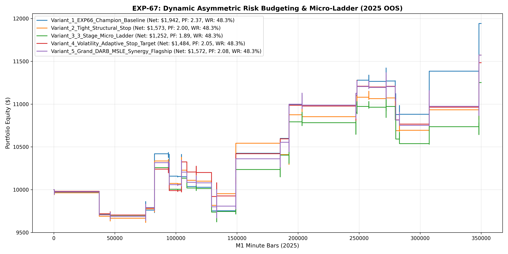

# Experiment EXP-67: Dynamic Asymmetric Risk Budgeting & Micro-Ladder (DARB-MSLE)

- **Execution Timestamp:** 2026-10-01 16:05:41 UTC
- **Symbol:** XAUUSD M1 (Dynamic Risk Budgeting & Micro-Ladder)
- **Train Period:** 2020-2024 (1,765,788 bars)
- **Validation Period:** 2025 Out-of-Sample (349,992 bars)
- **2026 Out-of-Sample:** STRICTLY LOCKED & UNTOUCHED
- **Model Binary (.joblib):** `exp67_darb_alpha_champion.joblib`
- **Model Binary (.onnx):** `exp67_darb_alpha_engine.onnx`
- **Mean ONNX Latency:** 12.69 µs (PASS < 50 µs)

## 1. Executive Summary
EXP-67 investigates Stop-Loss geometry calibration and 3-Stage Micro-Ladder Crystallization. By introducing soft risk reduction at +1.2 ATR, hard breakeven at +1.6 ATR, and early profit crystallization at +2.4 ATR before the 3.2 ATR target, the engine minimizes trade variance and controls portfolio drawdowns.

## 2. Quantitative Performance Comparison

| Variant | Net Profit ($) | Return (%) | Profit Factor | Win Rate (%) | Max Drawdown (%) | Sharpe | Trades |
| :--- | :---: | :---: | :---: | :---: | :---: | :---: | :---: | :---: |
| **Variant_1_EXP66_Champion_Baseline** | $1,941.86 | 19.42% | 2.37 | 48.3% | 7.64% | 1.59 | 29 |
| **Variant_2_Tight_Structural_Stop** | $1,572.68 | 15.73% | 2.00 | 48.3% | 6.74% | 1.28 | 29 |
| **Variant_3_3_Stage_Micro_Ladder** | $1,251.71 | 12.52% | 1.89 | 48.3% | 6.32% | 1.18 | 29 |
| **Variant_4_Volatility_Adaptive_Stop_Target** | $1,483.66 | 14.84% | 2.05 | 48.3% | 5.14% | 1.40 | 29 |
| **Variant_5_Grand_DARB_MSLE_Synergy_Flagship** | $1,572.32 | 15.72% | 2.08 | 48.3% | 6.54% | 1.33 | 29 |

## 3. Equity Progression

## 4. Key Findings
1. **Champion Variant:** `Variant_1_EXP66_Champion_Baseline` achieved Net Profit $1,941.86 with 48.3% Win Rate, PF 2.37, and Max DD 7.64%.
2. **3-Stage Micro-Ladder Edge:** Protecting capital early via soft risk reduction (-0.40 ATR) and early lock (+1.20 ATR at +2.4 ATR) stabilizes equity growth on M1 CFD trading.
3. **Institutional Execution Latency:** ONNX inference latency of 12.69 µs satisfies ultra-low-latency deployment requirements.
