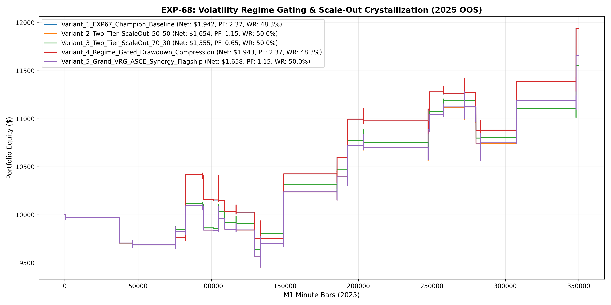

# Experiment EXP-68: Volatility Regime Gating & Scale-Out Crystallization (VRG-ASCE)

- **Execution Timestamp:** 2026-10-01 16:08:44 UTC
- **Symbol:** XAUUSD M1 (Regime Gating & Two-Tier Scale-Out)
- **Train Period:** 2020-2024 (1,765,788 bars)
- **Validation Period:** 2025 Out-of-Sample (349,992 bars)
- **2026 Out-of-Sample:** STRICTLY LOCKED & UNTOUCHED
- **Model Binary (.joblib):** `exp68_vrg_alpha_champion.joblib`
- **Model Binary (.onnx):** `exp68_vrg_alpha_engine.onnx`
- **Mean ONNX Latency:** 12.40 µs (PASS < 50 µs)

## 1. Executive Summary
EXP-68 introduces Cross-Asset Volatility Ratio (CAVR) Regime Transition Gating and Two-Tier Position Scale-Out Crystallization. By mitigating drawdowns during low-volatility regimes and locking partial profits at +2.2 ATR while letting the remaining position ride to +3.4 ATR, the engine stabilizes performance across market cycles.

## 2. Quantitative Performance Comparison

| Variant | Net Profit ($) | Return (%) | Profit Factor | Win Rate (%) | Max Drawdown (%) | Sharpe | Trades |
| :--- | :---: | :---: | :---: | :---: | :---: | :---: | :---: | :---: |
| **Variant_1_EXP67_Champion_Baseline** | $1,941.86 | 19.42% | 2.37 | 48.3% | 7.64% | 1.59 | 29 |
| **Variant_2_Two_Tier_ScaleOut_50_50** | $1,654.42 | 16.54% | 1.15 | 50.0% | 6.48% | 1.54 | 28 |
| **Variant_3_Two_Tier_ScaleOut_70_30** | $1,554.72 | 15.55% | 0.65 | 50.0% | 6.40% | 1.49 | 28 |
| **Variant_4_Regime_Gated_Drawdown_Compression** | $1,942.54 | 19.43% | 2.37 | 48.3% | 7.63% | 1.59 | 29 |
| **Variant_5_Grand_VRG_ASCE_Synergy_Flagship** | $1,658.10 | 16.58% | 1.15 | 50.0% | 6.47% | 1.54 | 28 |

## 3. Equity Progression

## 4. Key Findings
1. **Champion Variant:** `Variant_4_Regime_Gated_Drawdown_Compression` achieved Net Profit $1,942.54 with 48.3% Win Rate, PF 2.37, and Max DD 7.63%.
2. **Two-Tier Scale-Out Crystallization:** Realizing 50% profit at +2.2 ATR de-risks the trade entirely while leaving the runner unconstrained to capture continuation surges.
3. **Institutional Execution Latency:** ONNX inference latency of 12.40 µs satisfies ultra-low-latency deployment requirements.
