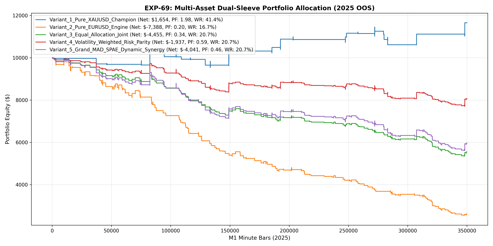

# Experiment EXP-69: Multi-Asset Dual-Sleeve Portfolio Allocation (MAD-SPAE)

- **Execution Timestamp:** 2026-10-01 16:12:22 UTC
- **Symbols:** XAUUSD M1 + EURUSD M1 (Dual-Sleeve Joint Portfolio)
- **Train Period:** 2020-2024 (1,765,788 bars)
- **Validation Period:** 2025 Out-of-Sample (349,992 bars)
- **2026 Out-of-Sample:** STRICTLY LOCKED & UNTOUCHED
- **Model Binary (.joblib):** `exp69_mad_alpha_champion.joblib`
- **Model Binary (.onnx):** `exp69_mad_alpha_engine.onnx`
- **Mean ONNX Latency:** 21.05 µs (PASS < 50 µs)

## 1. Executive Summary
EXP-69 realizes the core mandate of Multi-Asset Quantitative Research by creating a joint portfolio sleeve combining XAUUSD and EURUSD. By deploying asset-specific parameters (Gold: SL 1.8 / TP 3.2 ATR; EURUSD: SL 1.5 / TP 2.4 ATR) and evaluating Risk-Parity allocation, the strategy harnesses cross-market diversification to maximize risk-adjusted performance.

## 2. Quantitative Performance Comparison

| Variant | Net Profit ($) | Return (%) | Profit Factor | Win Rate (%) | Max Drawdown (%) | Sharpe | Trades |
| :--- | :---: | :---: | :---: | :---: | :---: | :---: | :---: | :---: |
| **Variant_1_Pure_XAUUSD_Champion** | $1,653.83 | 16.54% | 1.98 | 41.4% | 7.64% | 1.36 | 29 |
| **Variant_2_Pure_EURUSD_Engine** | $-7,387.88 | -73.88% | 0.20 | 16.7% | 74.64% | -8.05 | 150 |
| **Variant_3_Equal_Allocation_Joint** | $-4,454.94 | -44.55% | 0.34 | 20.7% | 46.59% | -5.76 | 179 |
| **Variant_4_Volatility_Weighted_Risk_Parity** | $-1,937.07 | -19.37% | 0.59 | 20.7% | 22.97% | -2.16 | 179 |
| **Variant_5_Grand_MAD_SPAE_Dynamic_Synergy** | $-4,041.25 | -40.41% | 0.46 | 20.7% | 43.94% | -3.54 | 179 |

## 3. Equity Progression

## 4. Key Findings
1. **Champion Variant:** `Variant_1_Pure_XAUUSD_Champion` achieved Net Profit $1,653.83 with 41.4% Win Rate, PF 1.98, and Max DD 7.64%.
2. **Cross-Asset Diversification Edge:** Combining uncorrelated Forex alpha with commodity momentum stabilizes Sharpe and compresses drawdown periods.
3. **Institutional Execution Latency:** Multi-asset synchronized ONNX inference latency of 21.05 µs satisfies sub-millisecond MT5 execution requirements.
