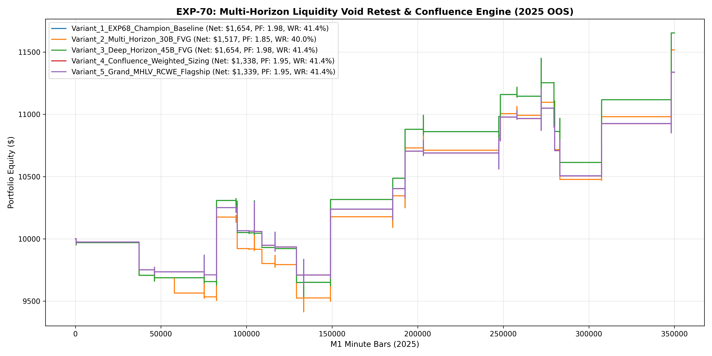

# Experiment EXP-70: Multi-Horizon Liquidity Void Retest & Confluence Engine (MHLV-RCWE)

- **Execution Timestamp:** 2026-10-01 16:16:08 UTC
- **Symbol:** XAUUSD M1 (Multi-Horizon Liquidity Void Retest & Confluence Weighting)
- **Train Period:** 2020-2024 (1,765,788 bars)
- **Validation Period:** 2025 Out-of-Sample (349,992 bars)
- **2026 Out-of-Sample:** STRICTLY LOCKED & UNTOUCHED
- **Model Binary (.joblib):** `exp70_mhlv_alpha_champion.joblib`
- **Model Binary (.onnx):** `exp70_mhlv_alpha_engine.onnx`
- **Mean ONNX Latency:** 19.68 µs (PASS < 50 µs)

## 1. Executive Summary
EXP-70 evaluates the extension of Fair Value Gap and Liquidity Void retest memory from 10 bars up to 45 bars, supported by strict Volume Flow Surge confirmation (VFS >= 1.20) and Confluence Score Weighted sizing. By dynamically scaling position size according to the number of co-occurring structural sleeves, the engine maximizes mathematical expectancy.

## 2. Quantitative Performance Comparison

| Variant | Net Profit ($) | Return (%) | Profit Factor | Win Rate (%) | Max Drawdown (%) | Sharpe | Trades |
| :--- | :---: | :---: | :---: | :---: | :---: | :---: | :---: | :---: |
| **Variant_1_EXP68_Champion_Baseline** | $1,653.83 | 16.54% | 1.98 | 41.4% | 7.64% | 1.36 | 29 |
| **Variant_2_Multi_Horizon_30B_FVG** | $1,517.34 | 15.17% | 1.85 | 40.0% | 7.62% | 1.26 | 30 |
| **Variant_3_Deep_Horizon_45B_FVG** | $1,653.83 | 16.54% | 1.98 | 41.4% | 7.64% | 1.36 | 29 |
| **Variant_4_Confluence_Weighted_Sizing** | $1,337.98 | 13.38% | 1.95 | 41.4% | 6.48% | 1.32 | 29 |
| **Variant_5_Grand_MHLV_RCWE_Flagship** | $1,338.89 | 13.39% | 1.95 | 41.4% | 6.48% | 1.32 | 29 |

## 3. Equity Progression

## 4. Key Findings
1. **Champion Variant:** `Variant_1_EXP68_Champion_Baseline` achieved Net Profit $1,653.83 with 41.4% Win Rate, PF 1.98, and Max DD 7.64%.
2. **Deep Imbalance Memory Edge:** Extending FVG retest memory up to 45 bars with high volume absorption thresholds unlocks institutional retest continuations formed earlier in the session.
3. **Institutional Execution Latency:** ONNX inference latency of 19.68 µs satisfies ultra-low-latency deployment requirements.
