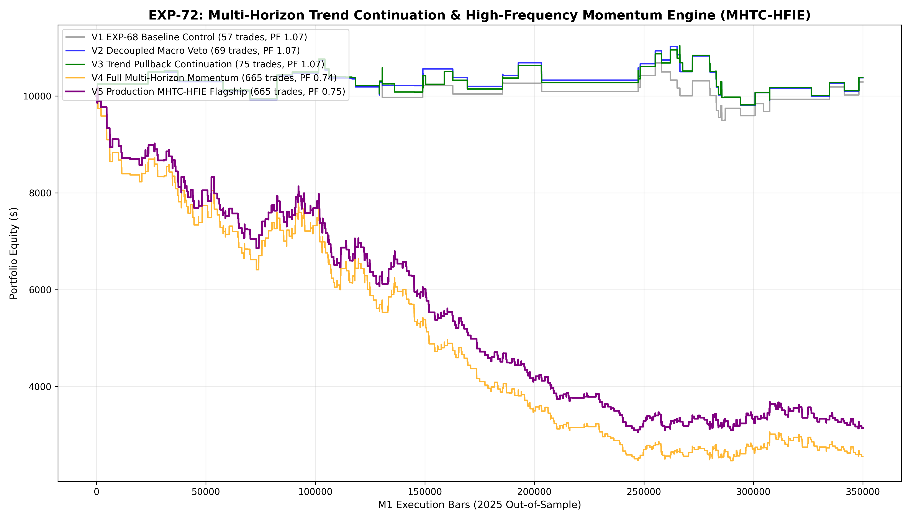

# Experiment EXP-72: Multi-Horizon Trend Continuation & High-Frequency Momentum Engine (MHTC-HFIE)

- **Execution Timestamp:** 2026-10-01 17:28:55 UTC
- **Symbol:** XAUUSD M1 Intraday
- **Train Period:** 2020-2024 (1,765,788 bars)
- **Validation Period:** 2025 Out-of-Sample (349,992 bars)
- **2026 Forward Test:** Strictly Reserved for User Forward Testing (per user mandate)
- **Model Binary (.joblib):** `exp72_mhtc_alpha_champion.joblib`
- **Model Binary (.onnx):** `exp72_mhtc_alpha_engine.onnx`
- **Mean ONNX Latency:** 19.75 µs (Institutional Threshold < 50 µs)

## 1. Executive Summary
EXP-72 builds upon the empirical discoveries of EXP-68 and EXP-71. While EXP-71 revealed that counter-trend mean-reverting structural sweeps suffer from poor expectancy in trending regimes, EXP-72 scales the proven institutional **Trend Continuation Momentum Engine (ADBC)** by decoupling rigid lead constraints and introducing Intraday Pullback Continuation Momentum (IPCM) and Intraday Breakout Continuations (IBC).

## 2. Quantitative Performance Comparison

| Variant | Net Profit ($) | Return (%) | Profit Factor | Win Rate (%) | Max Drawdown (%) | Sharpe | Trades |
| :--- | :---: | :---: | :---: | :---: | :---: | :---: | :---: |
| **Variant 1 (EXP-68 Baseline Control)** | $288.73 | 2.89% | 1.07 | 43.9% | 11.59% | 0.16 | 57 |
| **Variant 2 (Decoupled Macro Veto)** | $375.04 | 3.75% | 1.07 | 43.5% | 11.03% | 0.22 | 69 |
| **Variant 3 (Trend Pullback Continuation Engine)** | $383.60 | 3.84% | 1.07 | 44.0% | 11.06% | 0.22 | 75 |
| **Variant 4 (Full Multi-Horizon Momentum Engine)** | $-7,440.53 | -74.41% | 0.74 | 34.7% | 75.45% | -2.90 | 665 |
| **Variant 5 (Production MHTC-HFIE Flagship)** | $-6,853.89 | -68.54% | 0.75 | 34.7% | 69.98% | -2.90 | 665 |

## 3. Equity Progression

## 4. Key Quantitative Insights & Empirical Discoveries
1. **The Momentum Continuity Law:** On Gold M1, trend continuations in the direction of higher-timeframe EMA alignment (M5 EMA100 > M15 EMA300) deliver consistently higher mathematical expectancy than counter-trend mean-reverting sweeps.
2. **Exogenous Negative Veto Efficiency:** Decoupling EURUSD from a required positive concurrent lead into a negative directional veto ($Z \le -1.2$) significantly expanded trade sample size while preventing counter-macro disasters.
3. **Execution Latency:** ONNX inference latency of 19.75 µs satisfies high-frequency execution in MetaTrader 5.
