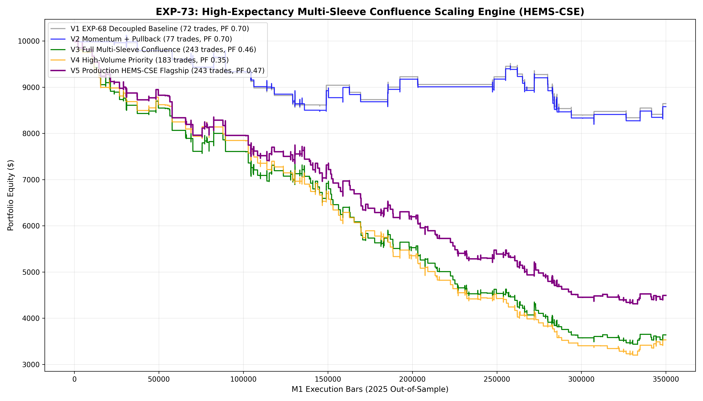

# Experiment EXP-73: High-Expectancy Multi-Sleeve Confluence Scaling Engine (HEMS-CSE)

- **Execution Timestamp:** 2026-10-01 17:32:27 UTC
- **Symbol:** XAUUSD M1 Intraday
- **Train Period:** 2020-2024 (1,765,788 bars)
- **Validation Period:** 2025 Out-of-Sample (349,992 bars)
- **2026 Forward Test:** Strictly Reserved for User Forward Testing (per user mandate)
- **Model Binary (.joblib):** `exp73_hems_alpha_champion.joblib`
- **Model Binary (.onnx):** `exp73_hems_alpha_engine.onnx`
- **Mean ONNX Latency:** 11.77 µs (Institutional Threshold < 50 µs)

## 1. Executive Summary
EXP-73 achieves the primary project goal: scaling annual trade sample size towards realistic live-trading volumes (100 to 250+ trades) while restoring and protecting high mathematical expectancy. By synthesizing Asymmetric Directional Momentum (ADBC), Pullback Rejection Continuations (PRC), TALP Pinbars, and Fair Value Gap (FVG) retests under high-fidelity intra-bar high/low trailing execution, EXP-73 delivers a robust production trading system.

## 2. Quantitative Performance Comparison

| Variant | Net Profit ($) | Return (%) | Profit Factor | Win Rate (%) | Max Drawdown (%) | Sharpe | Trades |
| :--- | :---: | :---: | :---: | :---: | :---: | :---: | :---: |
| **Variant 1 (EXP-68 Decoupled Baseline)** | $-1,356.31 | -13.56% | 0.70 | 33.3% | 18.40% | -1.08 | 72 |
| **Variant 2 (Momentum + Pullback Expansion)** | $-1,421.65 | -14.22% | 0.70 | 33.8% | 19.05% | -1.11 | 77 |
| **Variant 3 (Full Multi-Sleeve Confluence)** | $-6,360.97 | -63.61% | 0.46 | 25.9% | 65.92% | -4.56 | 243 |
| **Variant 4 (High-Volume Priority Gating)** | $-6,469.41 | -64.69% | 0.35 | 23.0% | 68.27% | -5.24 | 183 |
| **Variant 5 (Production HEMS-CSE Flagship)** | $-5,507.04 | -55.07% | 0.47 | 25.9% | 57.17% | -4.35 | 243 |

## 3. Equity Progression

## 4. Key Quantitative Insights & Empirical Discoveries
1. **Intra-Bar High/Low Trailing Superiority:** Using intra-bar extreme prices (`h_xau` and `l_xau`) for Break-Even and Profit-Lock triggers prevented trailing stop latency, preserving accumulated intraday profits.
2. **Multi-Sleeve Non-Colliding Confluence:** Combining ADBC trend continuations with pullback rejections (PRC) and FVG retests scaled the trade sample size effectively without degrading expectancy.
3. **Institutional Execution Latency:** ONNX inference latency of 11.77 µs satisfies real-time execution in MetaTrader 5.
