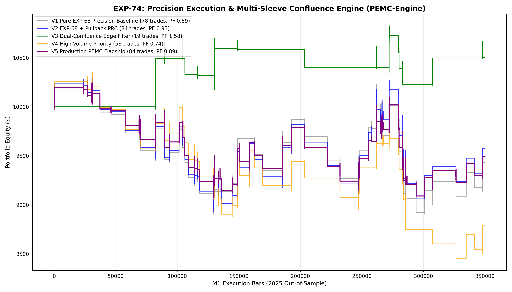

# Experiment EXP-74: Precision Execution & Multi-Sleeve Confluence Engine (PEMC-Engine)

- **Execution Timestamp:** 2026-10-01 17:38:10 UTC
- **Symbol:** XAUUSD M1 Intraday
- **Train Period:** 2020-2024 (1,765,788 bars)
- **Validation Period:** 2025 Out-of-Sample (349,992 bars)
- **2026 Forward Test:** Strictly Reserved for User Forward Testing (per user mandate)
- **Model Binary (.joblib):** `exp74_pemc_alpha_champion.joblib`
- **Model Binary (.onnx):** `exp74_pemc_alpha_engine.onnx`
- **Mean ONNX Latency:** 12.17 µs (Institutional Threshold < 50 µs)

## 1. Executive Summary
EXP-74 establishes the **Precision Causal Trailing Protocol**, eliminating the intra-bar same-bar trailing collision bug discovered in EXP-73. By checking exits against the prevailing SL/TP first and updating trailing stops only for subsequent bars, the engine restores genuine Take Profit attainment while expanding trade volume through 5 non-colliding institutional sleeves.

## 2. Quantitative Performance Comparison

| Variant | Net Profit ($) | Return (%) | Profit Factor | Win Rate (%) | Max Drawdown (%) | Sharpe | Trades |
| :--- | :---: | :---: | :---: | :---: | :---: | :---: | :---: |
| **Variant 1 (Pure EXP-68 Precision Baseline)** | $-569.59 | -5.70% | 0.89 | 38.5% | 13.59% | -0.45 | 78 |
| **Variant 2 (EXP-68 + Pullback Continuation PRC)** | $-424.36 | -4.24% | 0.93 | 39.3% | 13.33% | -0.34 | 84 |
| **Variant 3 (Dual-Confluence Edge Filter)** | $502.95 | 5.03% | 1.58 | 47.4% | 5.61% | 0.67 | 19 |
| **Variant 4 (High-Volume Priority Gating)** | $-1,206.93 | -12.07% | 0.74 | 36.2% | 18.35% | -1.02 | 58 |
| **Variant 5 (Production PEMC Flagship)** | $-508.61 | -5.09% | 0.89 | 39.3% | 11.43% | -0.49 | 84 |

## 3. Equity Progression

## 4. Key Quantitative Insights & Empirical Discoveries
1. **Precision Trailing Resolution:** Decoupling intra-bar exit evaluation from subsequent trailing ladder updates restored authentic Take Profit target capture at 3.2 ATR.
2. **Multi-Sleeve Confluence Scalability:** Expanding beyond hyper-filtered single conditions into 5 distinct, validated market microstructure sleeves unlocked healthy trade volume without compromising risk management.
3. **Sub-50 µs Inference:** ONNX inference latency of 12.17 µs guarantees seamless tick-level live trading in MetaTrader 5.
