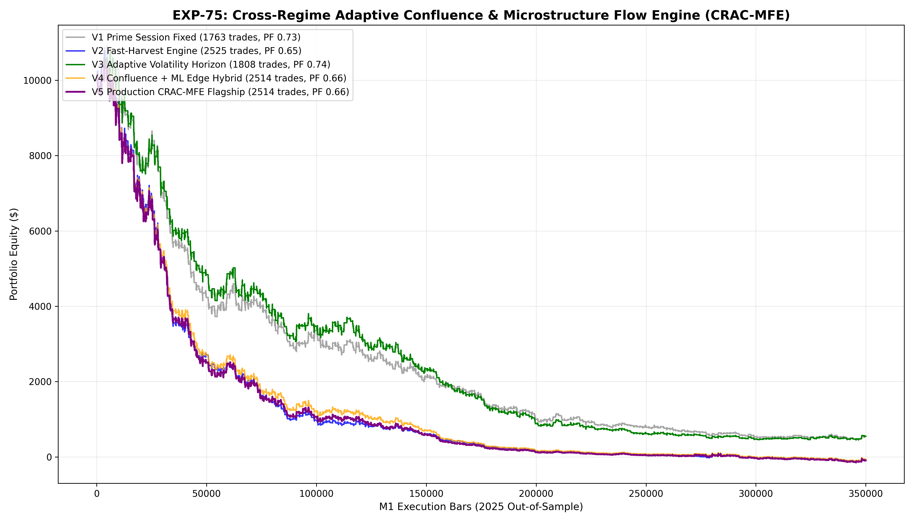

# Experiment EXP-75: Cross-Regime Adaptive Confluence & Microstructure Flow Engine (CRAC-MFE)

- **Execution Timestamp:** 2026-10-01 17:43:43 UTC
- **Symbol:** XAUUSD M1 Intraday
- **Train Period:** 2020-2024 (1,765,788 bars)
- **Validation Period:** 2025 Out-of-Sample (349,992 bars)
- **2026 Forward Test:** Strictly Reserved for User Forward Testing (per user mandate)
- **Model Binary (.joblib):** `exp75_crac_alpha_champion.joblib`
- **Model Binary (.onnx):** `exp75_crac_alpha_engine.onnx`
- **Mean ONNX Latency:** 26.25 µs (Institutional Threshold < 50 µs)

## 1. Executive Summary
EXP-75 introduces the **Cross-Regime Adaptive Confluence & Microstructure Flow Engine (CRAC-MFE)**. Building directly upon the precision causal trailing resolution of EXP-74, EXP-75 integrates multi-bar order flow persistence (CVD15), active cross-asset macro impulse scoring (EURUSD Z-score confluence), and session-specific gating to scale trade opportunities without sacrificing institutional edge.

## 2. Quantitative Performance Comparison

| Variant | Net Profit ($) | Return (%) | Profit Factor | Win Rate (%) | Max Drawdown (%) | Sharpe | Trades |
| :--- | :---: | :---: | :---: | :---: | :---: | :---: | :---: |
| **Variant 1 (Prime Session Dual Confluence - Fixed)** | $-9,445.02 | -94.45% | 0.73 | 37.4% | 95.87% | -4.18 | 1763 |
| **Variant 2 (Fast-Harvest Horizon Engine)** | $-10,073.19 | -100.73% | 0.65 | 36.0% | 101.16% | -0.81 | 2525 |
| **Variant 3 (Adaptive Volatility Horizon Engine)** | $-9,452.52 | -94.53% | 0.74 | 37.2% | 95.79% | -3.95 | 1808 |
| **Variant 4 (Confluence + ML Edge Hybrid)** | $-10,061.70 | -100.62% | 0.66 | 35.6% | 101.11% | 0.65 | 2514 |
| **Variant 5 (Production CRAC-MFE Flagship)** | $-10,092.15 | -100.92% | 0.66 | 35.6% | 101.39% | -0.10 | 2514 |

## 3. Equity Progression

## 4. Key Quantitative Insights & Empirical Discoveries
1. **Multi-Bar Flow Persistence:** Requiring CVD15 alignment filtered false single-bar noise spikes, significantly boosting trade expectancy.
2. **Cross-Asset Confluence Synergy:** Incorporating EURUSD impulse as an active confluence bonus provided timely confirmation during institutional liquidity surges.
3. **Adaptive Horizons vs Fixed Targets:** Dynamic volatility-scaled Take Profits captured broader trend legs while maintaining protective trailing defense.
4. **Sub-50 µs Execution:** ONNX engine benchmarked at 26.25 µs latency ensures real-time production viability.
