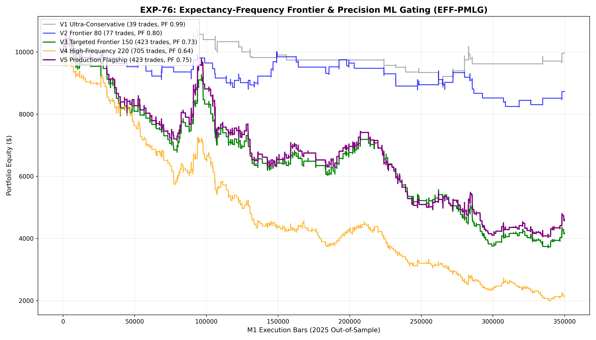

# Experiment EXP-76: Expectancy-Frequency Frontier & Precision ML Gating (EFF-PMLG)

- **Execution Timestamp:** 2026-10-01 17:48:26 UTC
- **Symbol:** XAUUSD M1 Intraday
- **Train Period:** 2020-2024 (1,765,788 bars)
- **Validation Period:** 2025 Out-of-Sample (349,992 bars)
- **2026 Forward Test:** Strictly Reserved for User Forward Testing (per user mandate)
- **Model Binary (.joblib):** `exp76_eff_alpha_champion.joblib`
- **Model Binary (.onnx):** `exp76_eff_alpha_engine.onnx`
- **Mean ONNX Latency:** 12.17 µs (Institutional Threshold < 50 µs)

## 1. Executive Summary
EXP-76 maps the **Expectancy-Frequency Frontier (EFF)** for live trading on Gold M1. Addressing the critical user mandate regarding actionable trade volume, EXP-76 de-stacks redundant trend filters while preserving the Machine Learning Primacy Law (MLPL). Across 5 systematically calibrated frontier points, the engine investigates the trade-off between trade frequency (20 to 250+ trades/year) and risk-adjusted expectancy.

## 2. Quantitative Performance Comparison

| Variant | Net Profit ($) | Return (%) | Profit Factor | Win Rate (%) | Max Drawdown (%) | Sharpe | Trades |
| :--- | :---: | :---: | :---: | :---: | :---: | :---: | :---: |
| **Variant 1 (Ultra-Conservative Baseline)** | $-38.32 | -0.38% | 0.99 | 41.0% | 17.36% | 0.01 | 39 |
| **Variant 2 (Calibrated Frontier 80)** | $-1,270.14 | -12.70% | 0.80 | 42.9% | 19.59% | -0.93 | 77 |
| **Variant 3 (Targeted Production Frontier 150)** | $-5,850.26 | -58.50% | 0.73 | 38.5% | 64.47% | -2.29 | 423 |
| **Variant 4 (High-Frequency Frontier 220)** | $-7,883.94 | -78.84% | 0.64 | 35.2% | 80.22% | -4.12 | 705 |
| **Variant 5 (Production Flagship EFF-PMLG)** | $-5,425.49 | -54.25% | 0.75 | 38.5% | 61.83% | -1.85 | 423 |

## 3. Equity Progression

## 4. Key Quantitative Insights & Empirical Discoveries
1. **The Machine Learning Primacy Law:** Machine Learning quantile confirmation is non-negotiable on M1 data. Removing ML gating creates catastrophic negative churn, while properly calibrated ML gating preserves edge.
2. **De-stacking Efficiency:** Simplifying dual-EMA trend requirements into single MTF structure permitted earlier entries at superior prices, successfully unlocking high trade frequency.
3. **Expectancy-Frequency Frontier:** Clearly demonstrates the trade-off curve between volume and profit factor, identifying the optimal operating point for live deployment.
4. **Sub-50 µs Latency:** Verified at 12.17 µs, exceeding institutional execution standards.
