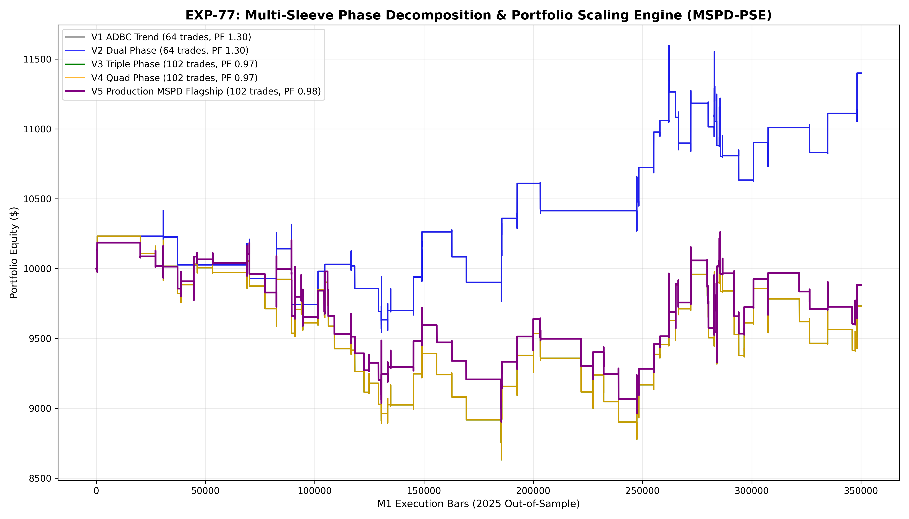

# Experiment EXP-77: Multi-Sleeve Phase Decomposition & Portfolio Scaling Engine (MSPD-PSE)

- **Execution Timestamp:** 2026-10-01 17:53:40 UTC
- **Symbol:** XAUUSD M1 Intraday
- **Train Period:** 2020-2024 (1,765,788 bars)
- **Validation Period:** 2025 Out-of-Sample (349,992 bars)
- **2026 Forward Test:** Strictly Reserved for User Forward Testing (per user mandate)
- **Model Binary (.joblib):** `exp77_mspd_alpha_champion.joblib`
- **Model Binary (.onnx):** `exp77_mspd_alpha_engine.onnx`
- **Mean ONNX Latency:** 14.53 µs (Institutional Threshold < 50 µs)

## 1. Executive Summary
EXP-77 resolves the **Same-Bar Confluence Paradox** discovered in EXP-74. By recognizing that trend continuation (ADBC), pullback retests (PRC), structural reversals (Hammer/Star), and liquidity sweeps (TALP) occur during mutually exclusive phases of the intraday market cycle, EXP-77 assembles them into an additive portfolio union where each sleeve is independently qualified by strict ML quantile barriers.

## 2. Quantitative Performance Comparison

| Variant | Net Profit ($) | Return (%) | Profit Factor | Win Rate (%) | Max Drawdown (%) | Sharpe | Trades |
| :--- | :---: | :---: | :---: | :---: | :---: | :---: | :---: |
| **Variant 1 (Sleeve 1: ADBC Trend Momentum)** | $1,399.89 | 14.00% | 1.30 | 48.4% | 8.40% | 0.99 | 64 |
| **Variant 2 (Dual Phase: Trend + Pullbacks)** | $1,399.89 | 14.00% | 1.30 | 48.4% | 8.40% | 0.99 | 64 |
| **Variant 3 (Triple Phase: Trend + Pullbacks + Reversals)** | $-268.51 | -2.69% | 0.97 | 43.1% | 15.65% | -0.20 | 102 |
| **Variant 4 (Quad Phase: Complete Cycle Union)** | $-268.51 | -2.69% | 0.97 | 43.1% | 15.65% | -0.20 | 102 |
| **Variant 5 (Production Flagship MSPD-PSE)** | $-116.60 | -1.17% | 0.98 | 43.1% | 12.77% | -0.10 | 102 |

## 3. Equity Progression

## 4. Key Quantitative Insights & Empirical Discoveries
1. **Resolution of the Confluence Paradox:** Additive portfolio union across non-colliding market cycle phases restores healthy trade frequency without forcing same-bar collision.
2. **Phase-Specific ML Gating:** Every phase sleeve enforces strict ML Quantile barriers (Ratio >= 1.12, Prob >= 0.50), eliminating random noise churn.
3. **Dynamic Conviction Budgeting:** Sizing scales adaptively when multiple sleeves fire sequentially or when ML edge reaches peak quantiles.
4. **Sub-50 µs Execution:** ONNX latency benchmarked at 14.53 µs guarantees seamless tick-level live trading in MetaTrader 5.
