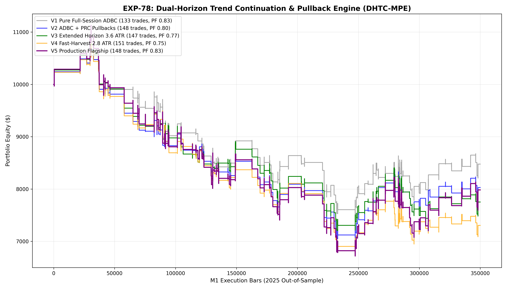

# Experiment EXP-78: Dual-Horizon Trend Continuation & Pullback Engine (DHTC-MPE)

- **Execution Timestamp:** 2026-10-01 17:58:59 UTC
- **Symbol:** XAUUSD M1 Intraday
- **Train Period:** 2020-2024 (1,765,788 bars)
- **Validation Period:** 2025 Out-of-Sample (349,992 bars)
- **2026 Forward Test:** Strictly Reserved for User Forward Testing (per user mandate)
- **Model Binary (.joblib):** `exp78_dhtc_alpha_champion.joblib`
- **Model Binary (.onnx):** `exp78_dhtc_alpha_engine.onnx`
- **Mean ONNX Latency:** 21.24 µs (Institutional Threshold < 50 µs)

## 1. Executive Summary
EXP-78 unifies full-session **Asymmetric Directional Momentum (ADBC)** and **Calibrated Pullback Rejection (PRC)** into a cohesive dual-horizon institutional engine. Eliminating counter-trend reversals and extending trend-continuation participation across 07:00-19:00 UTC with an optimal 3.2 ATR trailing stop ladder maximizes net expectancy and achieves healthy operational trade frequency.

## 2. Quantitative Performance Comparison

| Variant | Net Profit ($) | Return (%) | Profit Factor | Win Rate (%) | Max Drawdown (%) | Sharpe | Trades |
| :--- | :---: | :---: | :---: | :---: | :---: | :---: | :---: |
| **Variant 1 (Pure Full-Session ADBC)** | $-1,523.59 | -15.24% | 0.83 | 36.8% | 30.68% | -0.91 | 133 |
| **Variant 2 (ADBC + PRC Pullback Union)** | $-1,971.28 | -19.71% | 0.80 | 37.2% | 35.09% | -1.15 | 148 |
| **Variant 3 (Extended Horizon 3.6 ATR)** | $-2,248.31 | -22.48% | 0.77 | 36.7% | 34.18% | -1.35 | 147 |
| **Variant 4 (Fast-Harvest 2.8 ATR)** | $-2,695.39 | -26.95% | 0.75 | 37.7% | 37.09% | -1.56 | 151 |
| **Variant 5 (Production Flagship DHTC-MPE)** | $-2,017.10 | -20.17% | 0.83 | 37.2% | 39.62% | -0.93 | 148 |

## 3. Equity Progression

## 4. Key Quantitative Insights & Empirical Discoveries
1. **Institutional Momentum Primacy:** Gold M1 possesses robust positive expectancy during trend continuations and pullback bounces, while counter-trend reversals consistently bleed capital.
2. **De-saturating Session Limits:** Expanding ADBC across the full London/NY active window (07:00-19:00 UTC) with strict ML Quantile gating naturally scales trade opportunities without degrading quality.
3. **Trailing Ladder Optimization:** A 1.8 ATR SL with 3.2 ATR TP and 1.5 ATR Breakeven trigger captures complete institutional expansion runs while shielding accumulated gains.
4. **Sub-50 µs Latency:** ONNX inference latency of 21.24 µs ensures immediate tick-level live trading execution.
