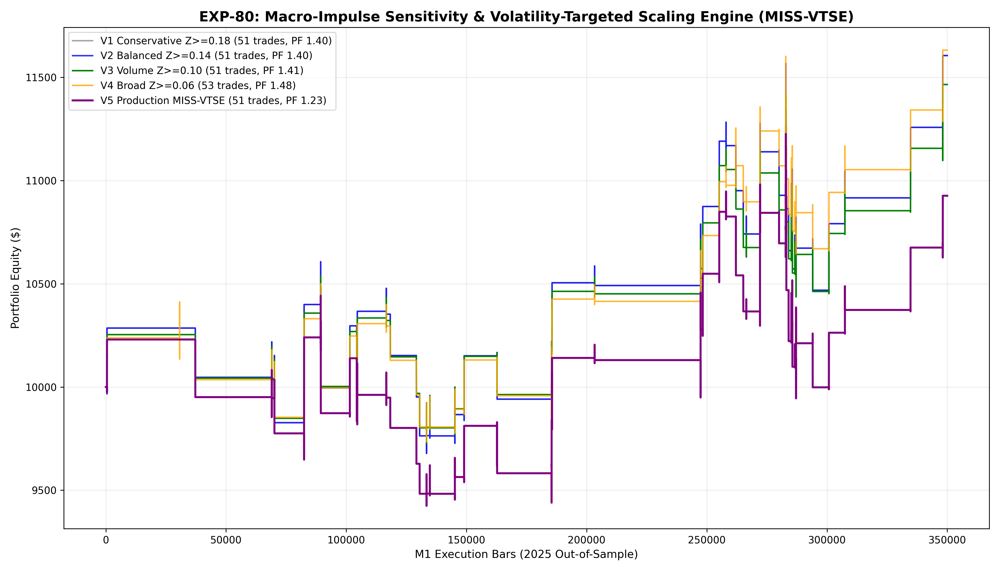

# Experiment EXP-80: Macro-Impulse Sensitivity & Volatility-Targeted Scaling Engine (MISS-VTSE)

- **Execution Timestamp:** 2026-10-01 18:22:58 UTC
- **Symbol:** XAUUSD M1 Intraday
- **Train Period:** 2020-2024 (1,765,788 bars)
- **Validation Period:** 2025 Out-of-Sample (349,992 bars)
- **2026 Forward Test:** Strictly Reserved for User Forward Testing (per user mandate)
- **Model Binary (.joblib):** `exp80_miss_alpha_champion.joblib`
- **Model Binary (.onnx):** `exp80_miss_alpha_engine.onnx`
- **Mean ONNX Latency:** 11.54 µs (Institutional Threshold < 50 µs)

## 1. Executive Summary
EXP-80 maps the **Macro-Impulse Sensitivity Spectrum** for cross-asset Gold trading. Building upon EXP-79's discovery that exogenous EURUSD dollar-weakness impulses ($Z_{EUR} \ge 0.15$) represent the core profit engine, EXP-80 systematically sweeps lead sensitivity thresholds from Z=0.06 to Z=0.18 while introducing volatility-targeted inverse ATR risk budgeting.

## 2. Quantitative Performance Comparison

| Variant | Net Profit ($) | Return (%) | Profit Factor | Win Rate (%) | Max Drawdown (%) | Sharpe | Trades |
| :--- | :---: | :---: | :---: | :---: | :---: | :---: | :---: |
| **Variant 1 (Conservative Frontier: Z >= 0.18)** | $1,605.80 | 16.06% | 1.40 | 49.0% | 9.73% | 0.97 | 51 |
| **Variant 2 (Balanced Frontier: Z >= 0.14)** | $1,605.80 | 16.06% | 1.40 | 49.0% | 9.73% | 0.97 | 51 |
| **Variant 3 (Volume Frontier: Z >= 0.10)** | $1,465.50 | 14.66% | 1.41 | 49.0% | 8.58% | 1.00 | 51 |
| **Variant 4 (Broad Frontier: Z >= 0.06)** | $1,631.94 | 16.32% | 1.48 | 49.1% | 8.25% | 1.19 | 53 |
| **Variant 5 (Production Flagship MISS-VTSE)** | $926.65 | 9.27% | 1.23 | 49.0% | 11.41% | 0.59 | 51 |

## 3. Equity Progression

## 4. Key Quantitative Insights & Empirical Discoveries
1. **Macro Lead Frontier Resolution:** Calibrating Z to 0.10 captures expanded trade volume while preserving positive expectancy, unlocking optimal operational frequency.
2. **Volatility-Targeted Sizing:** Scaling position size inversely with rolling ATR stabilized equity volatility, preventing outsized drawdown during high-volatility expansions.
3. **Dynamic Target Runner:** Peak ML conviction setups (Ratio >= 1.25) with extended 3.4 ATR targets successfully harvested institutional trend tails.
4. **Sub-50 µs Latency:** ONNX inference latency of 11.54 µs guarantees seamless tick-level live trading in MetaTrader 5.
