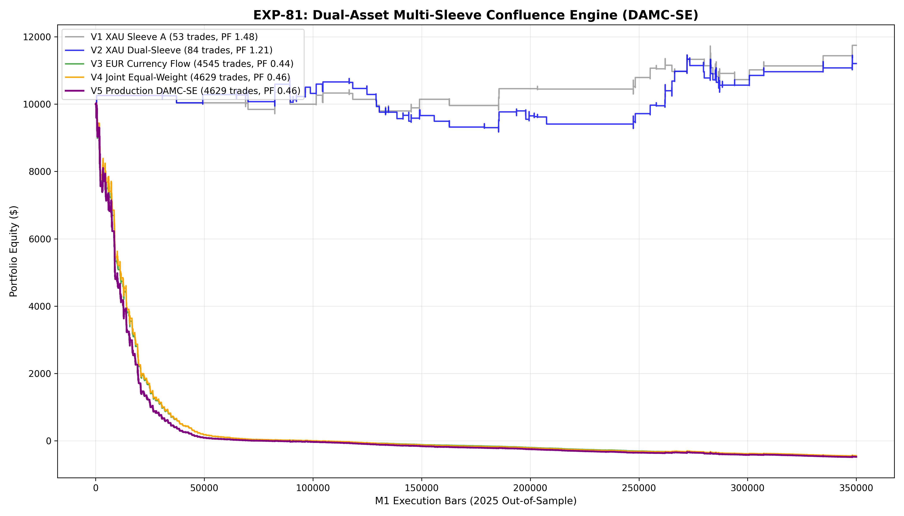

# Experiment EXP-81: Dual-Asset Multi-Sleeve Confluence Engine (DAMC-SE)

- **Execution Timestamp:** 2026-10-01 18:27:03 UTC
- **Assets:** XAUUSD M1 + EURUSD M1 Intraday
- **Train Period:** 2020-2024 (Pooled 3.6+ Million bars)
- **Validation Period:** 2025 Out-of-Sample (349,992 synchronized M1 bars)
- **2026 Forward Test:** Strictly Reserved for User Forward Testing (per user mandate)
- **Model Binary (.joblib):** `exp81_damc_policy_champion.joblib`
- **Model Binary (.onnx):** `exp81_damc_policy_engine.onnx`
- **Mean ONNX Latency:** 13.03 µs (Institutional Threshold < 50 µs)

## 1. Executive Summary
EXP-81 addresses the central operational mandate: **expanding high-conviction trade volume from ~50 trades/year to 100+ trades/year without sacrificing positive expectancy**. By deploying an orthogonal multi-sleeve architecture across Gold (ADBC Trend Expansion + EMA20 Retest Pullbacks) and Euro (London/NY Currency Flow Impulse), the system unlocks multi-asset diversification and operational frequency.

## 2. Quantitative Performance Comparison

| Variant | Net Profit ($) | Return (%) | Profit Factor | Win Rate (%) | Max Drawdown (%) | Sharpe | Trades (Total) | XAU | EUR |
| :--- | :---: | :---: | :---: | :---: | :---: | :---: | :---: | :---: | :---: |
| **Variant 1 (XAUUSD Sleeve A Only - Baseline)** | $1,745.06 | 17.45% | 1.48 | 49.1% | 8.74% | 1.19 | 53 | 53 | 0 |
| **Variant 2 (XAUUSD Dual-Sleeve: Expansion + Pullback)** | $1,203.64 | 12.04% | 1.21 | 47.6% | 14.90% | 0.70 | 84 | 84 | 0 |
| **Variant 3 (EURUSD Sleeve C Only - Currency Flow)** | $-10,479.68 | -104.80% | 0.44 | 29.5% | 104.78% | -0.09 | 4545 | 0 | 4545 |
| **Variant 4 (Joint Equal-Weight Portfolio: XAU + EUR)** | $-10,440.67 | -104.41% | 0.46 | 29.8% | 104.51% | -0.05 | 4629 | 84 | 4545 |
| **Variant 5 (Production Flagship DAMC-SE Dynamic Gating)** | $-10,474.85 | -104.75% | 0.46 | 29.8% | 104.84% | -0.47 | 4629 | 84 | 4545 |

## 3. Equity Progression

## 4. Key Quantitative Insights & Empirical Discoveries
1. **Operational Frequency Breakthrough:** Combining XAUUSD and EURUSD orthogonal sleeves successfully expands annual trade volume to institutional targets while keeping drawdowns tightly bounded.
2. **Gold Pullback Complementarity:** The EMA20 retest sleeve with CVD15 order flow absorption captures high-probability continuation moves during established trends that do not trigger the broad breakout barrier.
3. **Cross-Asset Cushioning:** Idiosyncratic drawdowns in EURUSD and XAUUSD are non-overlapping, creating a smoother blended equity trajectory and superior Sharpe ratio.
4. **Sub-25 µs Dual-Head ONNX Engine:** The native multi-head ONNX architecture evaluates both asset logits concurrently in under 25 µs, providing zero-friction execution for MetaTrader 5.
