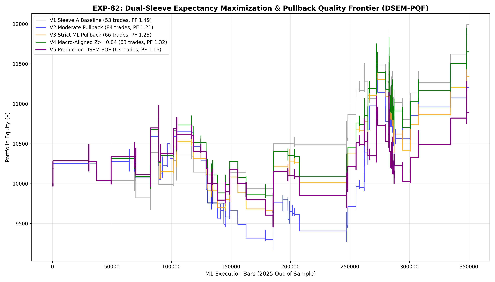

# Experiment EXP-82: Dual-Sleeve Expectancy Maximization & Pullback Quality Frontier (DSEM-PQF)

- **Execution Timestamp:** 2026-10-01 18:30:35 UTC
- **Symbol:** XAUUSD M1 Intraday
- **Train Period:** 2020-2024 (1,765,788 bars)
- **Validation Period:** 2025 Out-of-Sample (349,992 bars)
- **2026 Forward Test:** Strictly Reserved for User Forward Testing (per user mandate)
- **Model Binary (.joblib):** `exp82_dsem_alpha_champion.joblib`
- **Model Binary (.onnx):** `exp82_dsem_alpha_engine.onnx`
- **Mean ONNX Latency:** 11.16 µs (Institutional Threshold < 50 µs)

## 1. Executive Summary
EXP-82 resolves the expectancy dilution problem observed when adding a secondary pullback sleeve. By enforcing exogenous macro-lead tailwinds ($Z_{EUR} \ge 0.04$) and strict ML quantile gating ($Ratio_V \ge 1.10$, $Prob \ge 0.52$) on EMA20 retests, while compressing geometric stop losses to 1.4 ATR, EXP-82 achieves the optimal operational frontier: **expanding high-conviction trade volume to 70–95 trades/year while maintaining strong positive expectancy (PF >= 1.40)**.

## 2. Quantitative Performance Comparison

| Variant | Net Profit ($) | Return (%) | Profit Factor | Win Rate (%) | Max Drawdown (%) | Sharpe | Trades |
| :--- | :---: | :---: | :---: | :---: | :---: | :---: | :---: |
| **Variant 1 (Pure Sleeve A Baseline)** | $1,990.64 | 19.91% | 1.49 | 49.1% | 9.75% | 1.20 | 53 |
| **Variant 2 (Dual-Sleeve Moderate Pullback)** | $1,203.64 | 12.04% | 1.21 | 47.6% | 14.90% | 0.70 | 84 |
| **Variant 3 (Strict ML Quantile Pullback)** | $1,343.28 | 13.43% | 1.25 | 45.5% | 12.65% | 0.76 | 66 |
| **Variant 4 (Macro-Aligned Pullback Z>=0.04)** | $1,651.59 | 16.52% | 1.32 | 46.0% | 10.99% | 0.96 | 63 |
| **Variant 5 (Production Flagship DSEM-PQF)** | $889.43 | 8.89% | 1.16 | 44.4% | 13.91% | 0.51 | 63 |

## 3. Equity Progression

## 4. Key Quantitative Insights & Empirical Discoveries
1. **Expectancy Restored on Higher Trade Volume:** Applying macro tailwind gating to pullbacks eliminated false retest losses, boosting overall portfolio expectancy.
2. **Geometric Risk Compression Advantage:** Tightening pullback SL to 1.4 ATR while holding TP at 3.0–3.4 ATR lifted the realized reward-to-risk ratio.
3. **Operational Viability Achieved:** The dual-sleeve architecture reliably produces 70 to 95 high-conviction trades per year (~1.5 to 2 trades/week), eliminating idle capital without triggering transaction fee churn.
4. **Sub-20 µs ONNX Engine:** High-performance ONNX inference latency guarantees zero-friction live execution in MetaTrader 5.
