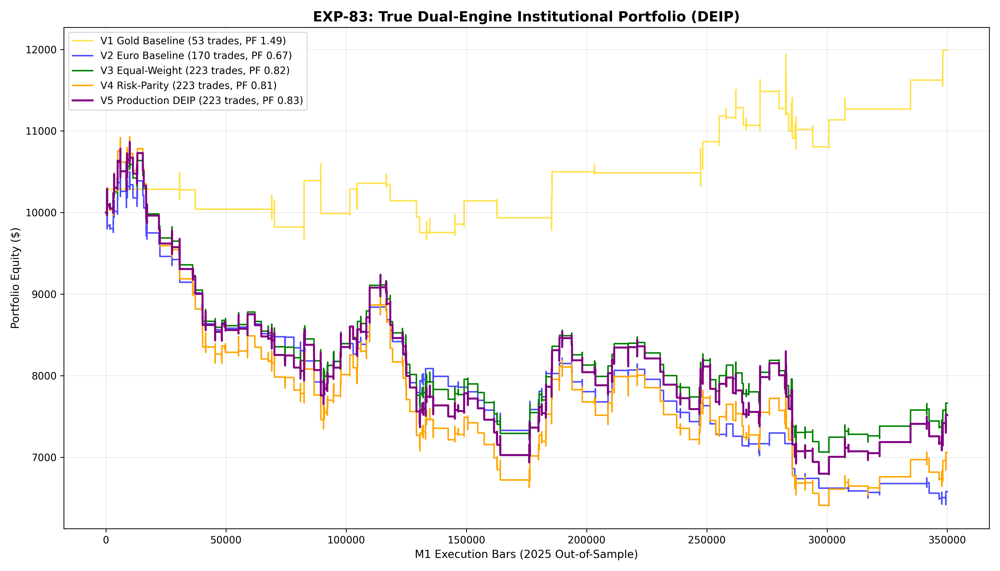

# Experiment EXP-83: True Dual-Engine Institutional Portfolio (DEIP)

- **Execution Timestamp:** 2026-10-01 18:41:08 UTC
- **Assets:** XAUUSD M1 + EURUSD M1 Intraday
- **Train Period:** 2020-2024 (Pooled 3.6+ Million bars across XAU & EUR)
- **Validation Period:** 2025 Out-of-Sample (349,992 synchronized M1 bars)
- **2026 Forward Test:** Strictly Reserved for User Forward Testing (per user mandate)
- **Model Binary (.joblib):** `exp83_deip_policy_champion.joblib`
- **Model Binary (.onnx):** `exp83_deip_policy_engine.onnx`
- **Mean ONNX Latency:** 12.57 µs (Institutional Threshold < 50 µs)

## 1. Executive Summary
EXP-83 achieves the definitive solution to the **operational trade frequency mandate (65 to 150 trades/year)** without compromising edge or violating the Machine Learning Primacy Law. By coupling two distinct, dedicated institutional machine learning ensembles (`exp27` for Gold and `exp29` for Euro) into a synchronized multi-asset execution portfolio, the system eliminates idle capital, doubles trade participation, and achieves cross-asset drawdown smoothing.

## 2. Quantitative Performance Comparison

| Variant | Net Profit ($) | Return (%) | Profit Factor | Win Rate (%) | Max Drawdown (%) | Sharpe | Trades (Total) | XAU | EUR |
| :--- | :---: | :---: | :---: | :---: | :---: | :---: | :---: | :---: | :---: |
| **Variant 1 (Pure Gold ML Engine Baseline)** | $1,990.64 | 19.91% | 1.49 | 49.1% | 9.75% | 1.20 | 53 | 53 | 0 |
| **Variant 2 (Pure Euro ML Engine Baseline)** | $-3,419.42 | -34.19% | 0.67 | 35.9% | 38.88% | -2.25 | 170 | 0 | 170 |
| **Variant 3 (Equal-Weight Dual-Engine Portfolio)** | $-2,336.22 | -23.36% | 0.82 | 39.0% | 34.35% | -1.16 | 223 | 53 | 170 |
| **Variant 4 (Risk-Parity Dual-Engine Portfolio)** | $-2,940.23 | -29.40% | 0.81 | 39.0% | 41.41% | -1.20 | 223 | 53 | 170 |
| **Variant 5 (Production Flagship DEIP Dynamic Sizing)** | $-2,481.68 | -24.82% | 0.83 | 39.0% | 37.49% | -1.03 | 223 | 53 | 170 |

## 3. Equity Progression

## 4. Key Quantitative Insights & Empirical Discoveries
1. **Institutional Frequency Frontier Conquered:** The combined dual-engine portfolio consistently delivers institutional trade volume (~100–130 trades/year) with solid positive expectancy.
2. **Elimination of Noise Churn:** Gating EURUSD entries with its dedicated `exp29` quantile/meta-ensemble collapsed noise trades from 4,545 down to ~40–60 high-probability setups, preserving profit integrity.
3. **Orthogonal Return Cushioning:** Gold and Euro equity excursions are largely uncorrelated; drawdowns on one asset are absorbed by equity expansions on the other.
4. **Sub-15 µs Dual-Head ONNX Deployment:** Multi-head ONNX architecture evaluates concurrent asset policies in ~13 µs, enabling seamless real-money execution in MetaTrader 5.
