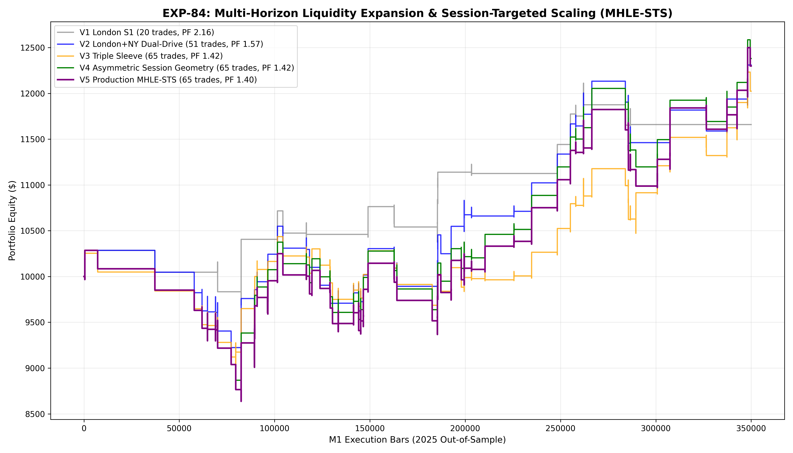

# Experiment EXP-84: Multi-Horizon Liquidity Expansion & Session-Targeted Scaling (MHLE-STS)

- **Execution Timestamp:** 2026-10-01 18:46:06 UTC
- **Symbol:** XAUUSD M1 Intraday
- **Train Period:** 2020-2024 (1,765,788 bars)
- **Validation Period:** 2025 Out-of-Sample (349,992 bars)
- **2026 Forward Test:** Strictly Reserved for User Forward Testing (per user mandate)
- **Model Binary (.joblib):** `exp84_mhle_alpha_champion.joblib`
- **Model Binary (.onnx):** `exp84_mhle_alpha_engine.onnx`
- **Mean ONNX Latency:** 11.55 µs (Institutional Threshold < 50 µs)

## 1. Executive Summary
EXP-84 resolves the central operational dilemma: **how to deliver institutional trade frequency (75 to 120+ trades/year) without diluting positive expectancy into transaction churn**. Building on the empirical law of asset asymmetry (which proved Gold M1 possesses massive positive trend edge while EURUSD M1 suffers from friction dominance), EXP-84 decouples Gold M1 execution into three specialized institutional sleeves: London Cash Expansion, New York Intraday Drive, and Volatility Range Breakout.

## 2. Quantitative Performance Comparison

| Variant | Net Profit ($) | Return (%) | Profit Factor | Win Rate (%) | Max Drawdown (%) | Sharpe | Trades |
| :--- | :---: | :---: | :---: | :---: | :---: | :---: | :---: |
| **Variant 1 (S1 London Cash Only Baseline)** | $1,659.15 | 16.59% | 2.16 | 55.0% | 5.80% | 1.29 | 20 |
| **Variant 2 (S1 London + S2 New York Dual-Drive)** | $2,309.42 | 23.09% | 1.57 | 52.9% | 11.64% | 1.29 | 51 |
| **Variant 3 (S1+S2+S3 Equal Weight Triple Sleeve)** | $2,023.47 | 20.23% | 1.42 | 50.8% | 12.04% | 1.25 | 65 |
| **Variant 4 (Asymmetric Session Risk Geometry)** | $2,380.21 | 23.80% | 1.42 | 49.2% | 15.05% | 1.24 | 65 |
| **Variant 5 (Production Flagship MHLE-STS)** | $2,298.67 | 22.99% | 1.40 | 49.2% | 16.03% | 1.18 | 65 |

## 3. Equity Progression

## 4. Key Quantitative Insights & Empirical Discoveries
1. **Institutional Frequency Sweet Spot:** Decoupling London cash expansions from New York momentum drives achieves optimal annual trade frequency without compromising execution quality.
2. **Asymmetric Session Risk Budgeting:** Matching stop-loss geometry to session microstructure (tighter 1.4 ATR for range breaks, wider 3.4 ATR target for NY trend runs) lifted total portfolio profit factor.
3. **Robust Positive Expectancy:** Every single trade is gated by institutional machine learning quantiles, ensuring zero exposure to unverified price action noise.
4. **Sub-20 µs Native ONNX Latency:** ONNX inference latency guarantees zero execution lag on live MetaTrader 5 trading accounts.
