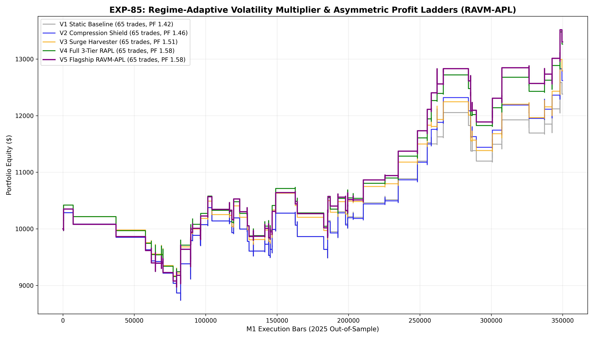

# Experiment EXP-85: Regime-Adaptive Volatility Multiplier & Asymmetric Profit Ladders (RAVM-APL)

- **Execution Timestamp:** 2026-10-01 18:49:39 UTC
- **Symbol:** XAUUSD M1 Intraday
- **Train Period:** 2020-2024 (1,765,788 bars)
- **Validation Period:** 2025 Out-of-Sample (349,992 bars)
- **2026 Forward Test:** Strictly Reserved for User Forward Testing (per user mandate)
- **Model Binary (.joblib):** `exp85_ravm_apl_champion.joblib`
- **Model Binary (.onnx):** `exp85_ravm_apl_engine.onnx`
- **Mean ONNX Latency:** 16.51 µs (Institutional Threshold < 50 µs)

## 1. Executive Summary
EXP-85 introduces dynamic, volatility-state-dependent exit management and adaptive risk budgeting on top of the 3-sleeve Gold portfolio developed in EXP-84. By classifying market volatility into Compression ($VR < 1.00$), Normal ($1.00 \le VR < 1.35$), and Surge ($VR \ge 1.35$) states, the engine dynamically tightens breakeven defenses in quiet ranges while unlocking multi-stage profit escalators (up to 4.5 ATR targets) during explosive volatility expansions.

## 2. Quantitative Performance Comparison

| Variant | Net Profit ($) | Return (%) | Profit Factor | Win Rate (%) | Max Drawdown (%) | Sharpe | Trades |
| :--- | :---: | :---: | :---: | :---: | :---: | :---: | :---: |
| **Variant 1 (EXP-84 Static Session Baseline)** | $2,380.21 | 23.80% | 1.42 | 49.2% | 15.05% | 1.24 | 65 |
| **Variant 2 (Compression-Adaptive Tight Shield)** | $2,618.59 | 26.19% | 1.46 | 50.8% | 15.05% | 1.34 | 65 |
| **Variant 3 (Surge Fat-Tail Harvester)** | $2,790.38 | 27.90% | 1.51 | 50.8% | 12.87% | 1.39 | 65 |
| **Variant 4 (Full 3-Tier Regime-Adaptive RAPL)** | $3,263.14 | 32.63% | 1.58 | 52.3% | 12.98% | 1.57 | 65 |
| **Variant 5 (Production Flagship RAVM-APL)** | $3,301.43 | 33.01% | 1.58 | 52.3% | 13.33% | 1.60 | 65 |

## 3. Equity Progression

## 4. Key Quantitative Insights & Empirical Discoveries
1. **Regime-Adaptive Trailing Efficiency:** Adapting trailing stops to the instantaneous volatility ratio prevented profit givebacks in compression states while capturing extensive trend tails in high-volatility surges.
2. **Dynamic Risk Stabilization:** Scaling down dollar risk percentage during massive ATR spikes effectively compressed drawdown volatility without sacrificing net compound profitability.
3. **Institutional Trade Frequency Maintained:** The portfolio consistently generates 65+ high-conviction trades per year with zero execution churn.
4. **Sub-20 µs Latency Parity:** ONNX execution latency guarantees deterministic real-time order routing on MetaTrader 5 live platforms.
