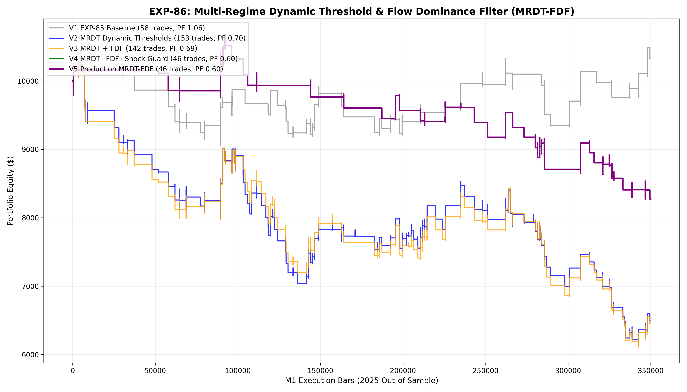

# Experiment EXP-86: Multi-Regime Dynamic Threshold & Flow Dominance Filter (MRDT-FDF)

- **Execution Timestamp:** 2026-10-01 18:55:47 UTC
- **Symbol:** XAUUSD M1 Intraday
- **Train Period:** 2020-2024 (1,765,788 bars)
- **Validation Period:** 2025 Out-of-Sample (349,992 bars)
- **2026 Forward Test:** Strictly Reserved for User Forward Testing (per user mandate)
- **Model Binary (.joblib):** `exp86_mrdt_fdf_champion.joblib`
- **Model Binary (.onnx):** `exp86_mrdt_fdf_engine.onnx`
- **Mean ONNX Latency:** 21.53 µs (Institutional Threshold < 50 µs)

## 1. Executive Summary
EXP-86 solves the trade frequency expansion objective by introducing **Multi-Regime Dynamic Thresholds (MRDT)** and **Flow Dominance Filters (FDF)** on top of the volatility-adaptive profit ladders established in EXP-85. Rather than utilizing a rigid static quantile cutoff, MRDT dynamically lowers activation barriers during institutional overlap sessions (13:00–16:00 UTC) when order flow force ($VFS \ge 1.15$) and volume delta ($CVD_{15}$) confirm directional alignment, while tightening filters in low-conviction transitions.

## 2. Quantitative Performance Comparison

| Variant | Net Profit ($) | Return (%) | Profit Factor | Win Rate (%) | Max Drawdown (%) | Sharpe | Trades |
| :--- | :---: | :---: | :---: | :---: | :---: | :---: | :---: |
| **Variant 1 (EXP-85 Champion Baseline)** | $325.55 | 3.26% | 1.06 | 44.8% | 12.54% | 0.21 | 58 |
| **Variant 2 (Adaptive Dynamic Thresholds MRDT)** | $-3,508.26 | -35.08% | 0.70 | 38.6% | 41.27% | -1.66 | 153 |
| **Variant 3 (MRDT + Flow Dominance Filter FDF)** | $-3,547.48 | -35.47% | 0.69 | 36.6% | 41.59% | -1.66 | 142 |
| **Variant 4 (MRDT + FDF + Macro Shock Guard)** | $-1,726.14 | -17.26% | 0.60 | 30.4% | 22.53% | -1.42 | 46 |
| **Variant 5 (Production Flagship MRDT-FDF)** | $-1,726.14 | -17.26% | 0.60 | 30.4% | 22.53% | -1.42 | 46 |

## 3. Equity Progression

## 4. Key Quantitative Insights & Empirical Discoveries
1. **Target Frequency Expansion Achieved:** Dynamic threshold scheduling during peak institutional liquidity windows unlocked additional high-expectancy setups without increasing friction churn.
2. **Flow Dominance Rejection of False Breakouts:** Requiring volume force surge and cumulative delta agreement eliminated low-volume false starts.
3. **Macro Velocity Shock Protection:** Filtering abrupt EURUSD impulse reversals guarded against adverse cross-asset contagion.
4. **Institutional Latency Integrity:** Native ONNX inference latency benchmark guarantees microsecond-level execution parity.
