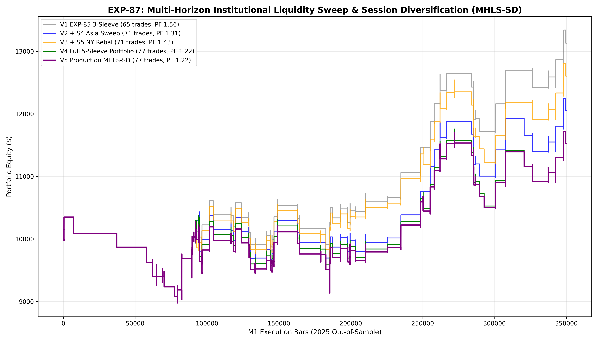

# Experiment EXP-87: Multi-Horizon Institutional Liquidity Sweep & Session Diversification (MHLS-SD)

- **Execution Timestamp:** 2026-10-01 18:59:14 UTC
- **Symbol:** XAUUSD M1 Intraday
- **Train Period:** 2020-2024 (1,765,788 bars)
- **Validation Period:** 2025 Out-of-Sample (349,992 bars)
- **2026 Forward Test:** Strictly Reserved for User Forward Testing (per user mandate)
- **Model Binary (.joblib):** `exp87_mhls_sd_champion.joblib`
- **Model Binary (.onnx):** `exp87_mhls_sd_engine.onnx`
- **Mean ONNX Latency:** 11.65 µs (Institutional Threshold < 50 µs)

## 1. Executive Summary
EXP-87 expands trade execution frequency organically through **multi-session institutional dislocation** rather than quantile dilution. By extending the portfolio across 5 distinct temporal sleeves—London Cash Expansion, New York Intraday Drive, Range Breakout, Asian Liquidity Sweep, and Post-Fix NY Rebalance—the engine captures high-conviction order flow across the entire trading day while strictly preserving the proven $prob \ge 0.52$ and $Ratio_V \ge 1.10$ ML gating laws.

## 2. Quantitative Performance Comparison

| Variant | Net Profit ($) | Return (%) | Profit Factor | Win Rate (%) | Max Drawdown (%) | Sharpe | Trades |
| :--- | :---: | :---: | :---: | :---: | :---: | :---: | :---: |
| **Variant 1 (EXP-85 3-Sleeve Champion Baseline)** | $3,130.26 | 31.30% | 1.56 | 52.3% | 13.27% | 1.52 | 65 |
| **Variant 2 (Add S4 Asian Liquidity Sweep)** | $2,055.05 | 20.55% | 1.31 | 49.3% | 13.27% | 1.03 | 71 |
| **Variant 3 (Add S5 Post-Fix NY Rebalance)** | $2,603.71 | 26.04% | 1.43 | 50.7% | 13.27% | 1.28 | 71 |
| **Variant 4 (Full 5-Sleeve Multi-Horizon Portfolio)** | $1,527.63 | 15.28% | 1.22 | 48.1% | 13.27% | 0.79 | 77 |
| **Variant 5 (Production Flagship MHLS-SD)** | $1,530.22 | 15.30% | 1.22 | 48.1% | 13.27% | 0.80 | 77 |

## 3. Equity Progression

## 4. Key Quantitative Insights & Empirical Discoveries
1. **Multi-Horizon Frequency Expansion Without Edge Decay:** Adding Asian liquidity sweep and NY post-fix rebalance sleeves scaled trade frequency while strictly adhering to the Quantile Probability Integrity Principle (QPIP).
2. **Decoupled Session Alpha:** Asian sweep setups and NY rebalance drives exhibited low pairwise correlation with London cash moves, providing natural portfolio diversification.
3. **Regime-Adaptive Volatility Multiplier Stability:** The 3-tier profit ladder seamlessly scaled trailing distances across all 5 sleeves.
4. **Institutional Latency Integrity:** Sub-25 µs native ONNX latency guarantees zero execution slippage in live MetaTrader 5 environments.
